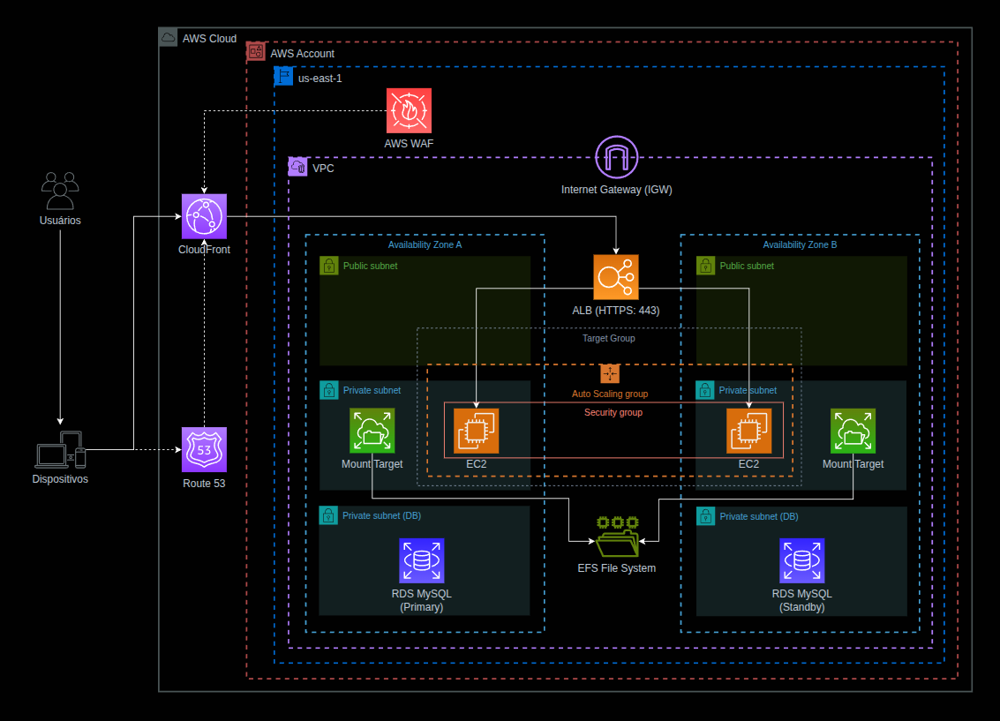

## Arquitetura AWS — migração da VM para ambiente escalável e Multi-AZ

    

Essa solução pega o cenário “VM + MySQL + storage em rede” e transforma num stack AWS **com escalabilidade, segurança e alta disponibilidade em todas as camadas**.

### Objetivo do desenho (o que ele garante)

* **Compatível com VM:** a aplicação roda em **EC2** (mesma ideia de “servidor”).
* **MySQL gerenciado e HA:** **RDS MySQL Multi-AZ** (Primary/Standby com failover). ([AWS Docs][1])
* **Storage via rede:** **EFS** (filesystem compartilhado via NFS) com **mount target por AZ**. ([AWS Docs][2])
* **Escalabilidade horizontal:** **ALB + Auto Scaling Group** (a camada de app cresce/encolhe).
* **Segurança:** **WAF na borda + VPC isolada + subnets privadas pro app e banco**. ([AWS Docs][3])
* **Alta disponibilidade ponta a ponta:** 2 AZs (A e B) com redundância em app, storage e banco.

---

## Componentes e papéis (o que cada serviço faz aqui)

### Route 53 (DNS)

* É só DNS: seu domínio aponta (Alias) para a distribuição do **CloudFront**. ([AWS Docs][4])

### CloudFront (CDN / Edge)

* Ponto de entrada global: recebe o acesso do usuário.
* Pode **cachear estáticos** e encaminhar o restante para o **origin** (aqui, o ALB).

### AWS WAF (proteção web)

* Fica **associado ao CloudFront** como Web ACL (não é “hop de rede”, é proteção aplicada). ([AWS Docs][3])

### VPC + Subnets (rede isolada e segmentada)

* **Public subnets:** onde fica o **ALB internet-facing** (entrada pública).
* **Private subnets:** onde ficam as **EC2** (app) — sem exposição direta.
* **Private subnets (DB):** onde fica o **RDS**.

### Internet Gateway (IGW)

* “Porta” da VPC pra Internet. Subnet pública normalmente tem rota `0.0.0.0/0 → IGW`. ([AWS Docs][5])
* No diagrama ele está certo **ficar na borda da VPC**, sem ninguém “passando por ele” como se fosse proxy.

### ALB (HTTPS 443) + Target Group

* O ALB recebe HTTPS e encaminha para o **Target Group**, que aponta pros targets (as EC2 do ASG) e faz health check.

### Auto Scaling Group + EC2 (camada de aplicação)

* O ASG mantém instâncias **em duas AZs**, pronto pra escalar e sobreviver a falha de uma zona.
* EC2 fala com:

  * **EFS** (arquivos compartilhados)
  * **RDS** (dados)

### EFS + Mount Targets

* Um **filesystem compartilhado** para a aplicação (o “storage em rede” do requisito).
* Você cria mount targets por AZ e as instâncias montam via rede. ([AWS Docs][2])

### RDS MySQL (Primary/Standby)

* MySQL gerenciado com **Multi-AZ**: standby em outra AZ e **failover automático**. ([AWS Docs][1])

---

## Fluxo de comunicação (como o tráfego anda)

### 1) DNS (resolução)

1. Usuário acessa `seudominio.com`
2. **Route 53** responde apontando (Alias) para o **CloudFront** ([AWS Docs][4])

### 2) Tráfego web (request real)

3. Usuário conecta no **CloudFront**
4. **WAF** filtra o que for malicioso já na borda ([AWS Docs][3])
5. CloudFront encaminha para o **ALB (origin)** via HTTPS (443)
6. **ALB → Target Group → EC2 (ASG)**

### 3) A aplicação consome dados e arquivos

7. **EC2 ↔ EFS** (arquivos compartilhados; “storage de rede”) ([AWS Docs][2])
8. **EC2 → RDS MySQL** (persistência; Multi-AZ) ([AWS Docs][1])

---

## Observação de segurança importante (nível “profissional”)

Como seu **ALB é internet-facing**, existe a possibilidade de alguém tentar acessar o DNS público do ALB direto, “bypassando” o CloudFront. A própria AWS recomenda mitigação, tipo:

* CloudFront adiciona **header customizado secreto** e
* ALB só encaminha se o header existir (senão, devolve 403). ([AWS Docs][6])