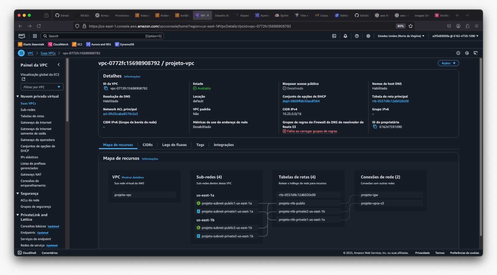
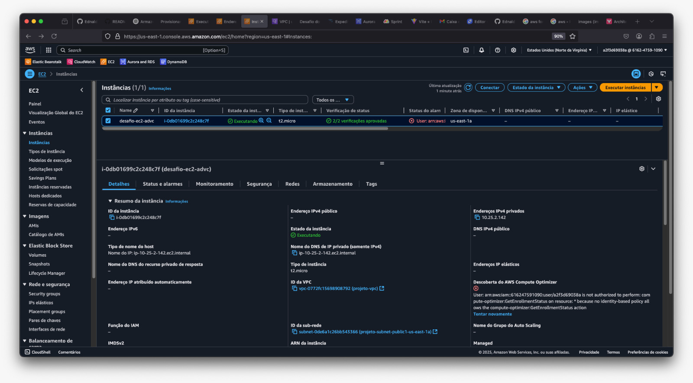

<h1 align=center> 📂 Desafio: Provisionamento de Ambiente Web na AWS </h1>

<div>
    
</div>

<h2 align=center> 📌 Visão Geral </h2>
A **Dan's Coffee** está testando a migração da sua aplicação web para a AWS, utilizando uma instância **EC2** e serviços de rede para garantir a conectividade e acessibilidade adequadas. O objetivo é validar a viabilidade da nuvem como ambiente de hospedagem para a aplicação da empresa.

Este desafio faz parte de uma **Prova de Conceito (PoC)** para avaliar a estabilidade, segurança e funcionamento da aplicação na infraestrutura AWS.

🔹 **Requisitos:**
- Criar uma **VPC com CIDR 10.25.0.0/16**;
- Criar **2 subnets públicas** e **2 subnets privadas** em **AZs distintas**;
- Criar um **Internet Gateway** e configurar a tabela de rotas para permitir acesso externo às subnets públicas;
- Provisionar uma **instância EC2** em uma **subnet pública**, utilizando a AMI **Amazon Linux mais recente**;
- Configurar o seguinte código de provisionamento para subir a aplicação web:

```yaml
#cloud-config
package_upgrade: true
packages:
- httpd
runcmd:
- cd /var/www/html/ && wget https://repo-desafios.danrezende.com/projetoweb1/index.html
- service httpd start
- chkconfig httpd on
```

- **Atribuir um Elastic IP à instância EC2** para garantir um IP fixo.
- A região deve ser **us-east-1 (N. Virginia)**.
- O prazo de entrega é de **2 horas**.

<h2 align=center> 🚀 Implementação </h2>

<h3 align=center> 1️⃣ Criar a VPC e Subnets </h3>

1. Criar a **VPC** com CIDR **10.25.0.0/16**.
2. Criar **2 subnets públicas** (`10.25.1.0/24` e `10.25.2.0/24`).
3. Criar **2 subnets privadas** (`10.25.3.0/24` e `10.25.4.0/24`).

<div>
    
</div>

<h3 align=center> 2️⃣ Configurar o Internet Gateway e Rotas </h3>

1. Criar um **Internet Gateway** e anexá-lo à VPC.
2. Criar uma **Tabela de Rotas** e adicionar:
   - **Destino:** `0.0.0.0/0` → **Target:** Internet Gateway.
3. Associar essa tabela às **subnets públicas**.
4. **Habilitar a atribuição automática de IP público** nas subnets públicas.

<div>
    
</div>

<h3 align=center> 3️⃣ Criar e Configurar a Instância EC2 </h3>

1. Criar uma **EC2 (t2.micro, Amazon Linux)** na **subnet pública**.
2. Inserir o **User Data** (código de provisionamento acima).
3. Criar um **Security Group** e permitir:
   - **Porta 80 (HTTP)** para acesso à aplicação.
   - **Porta 22 (SSH)** apenas para seu IP.
4. Criar ou utilizar um **par de chaves SSH** para acesso.
5. **Executar a instância**.

<div>
    
</div>

<h3 align=center> 4️⃣ Associar o Elastic IP </h3>

1. Criar um **Elastic IP**.
2. Associar o Elastic IP à instância EC2.
3. Confirmar que a instância agora tem um **IP fixo público**.

<h3 align=center> 5️⃣ Testar o Acesso </h3>

1. Copiar o **Endereço IPv4 Público** da EC2.
2. Acessar no navegador:
   ```
   http://SEU_IP_ELÁSTICO
   ```
3. Verificar se a página do projeto web está carregando corretamente.

<div>
    
</div>

<h2 align=center> 🏆 Conclusão </h2>

O desafio validou a capacidade de provisionamento de ambientes web na AWS de maneira organizada e segura, garantindo que a **Dan's Coffee** possa avançar com a migração para a nuvem de forma confiante.