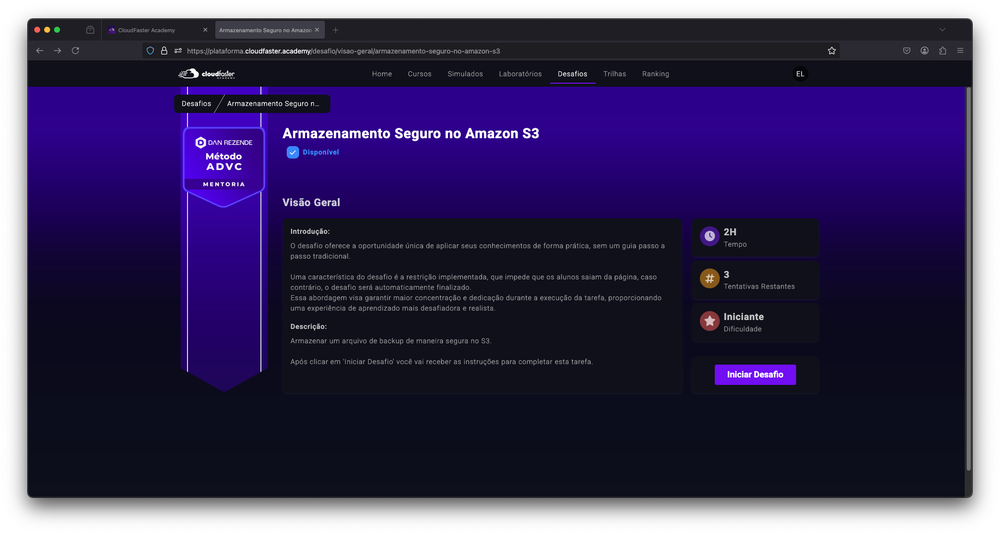
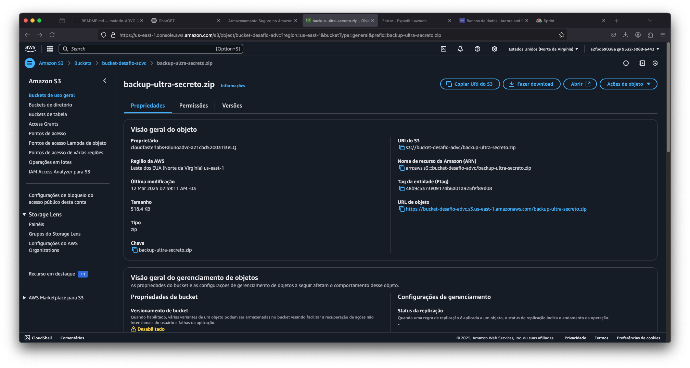
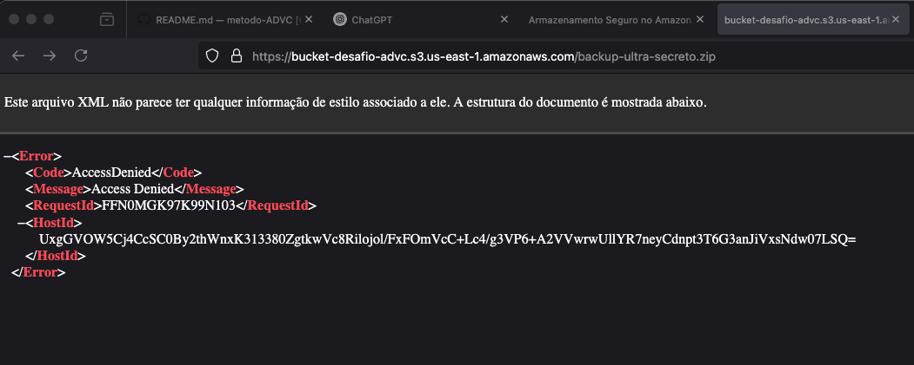

<h1 align=center> 📂 Desafio: Armazenamento Seguro no Amazon S3 </h1>

    

<h2 align=center> 📌 Visão Geral </h2>
A **Dan's Coffee** busca armazenar seus backups de forma segura na nuvem, utilizando o **Amazon S3** como serviço de armazenamento. O objetivo principal é garantir que os arquivos sejam protegidos contra acessos não autorizados e estejam criptografados.

Este desafio faz parte de uma **Prova de Conceito (PoC)** para validar a viabilidade da nuvem como solução definitiva para backup da empresa.

🔹 **Requisitos:**
- O arquivo deve ser armazenado no **Amazon S3**;
- Deve estar **criptografado**;
- O acesso ao arquivo deve ser **restrito (privado)**;
- O bucket deve estar na região **us-east-1 (N. Virginia)**;
- O prazo de entrega é de **2 horas**.

<h2 align=center>  🚀 Implementação </h2>

<h3 align=center> 1️⃣ Criar o Bucket no Amazon S3

1. Acesse o console da AWS e vá para o **Amazon S3**.
2. Clique em **Criar bucket** e defina um nome único.
3. Escolha a região **N. Virginia (us-east-1)**.
4. **Desative** o acesso público ao bucket.
5. **Habilite** a criptografia com AWS-KMS ou AES-256.
6. Finalize a criação do bucket.

<h3 align=center> 2️⃣ Upload do Arquivo com Segurança <h3>

    

1. No console do **Amazon S3**, acesse o bucket criado.
2. Clique em **Upload** e selecione o arquivo `backup-ultra-secreto.zip`.
3. Marque a opção **criptografar** com AES-256 ou KMS.
4. Finalize o upload garantindo que o arquivo não está público.

<h3 align=center> 3️⃣ Validação de Segurança <h3>

Para validar que o arquivo **não é acessível publicamente**, tente acessá-lo via URL pública. O retorno deve ser **Access Denied**.

    

<h2 align=center>  🏆 Conclusão </h2>

A configuração correta do **Amazon S3** garante que os backups da **Dan's Coffee** estejam protegidos e acessíveis somente para usuários autorizados. Essa PoC permite que a empresa valide a segurança antes de migrar definitivamente para a nuvem.