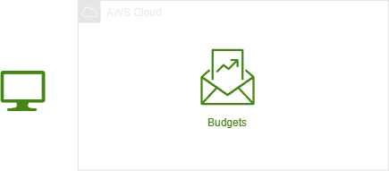
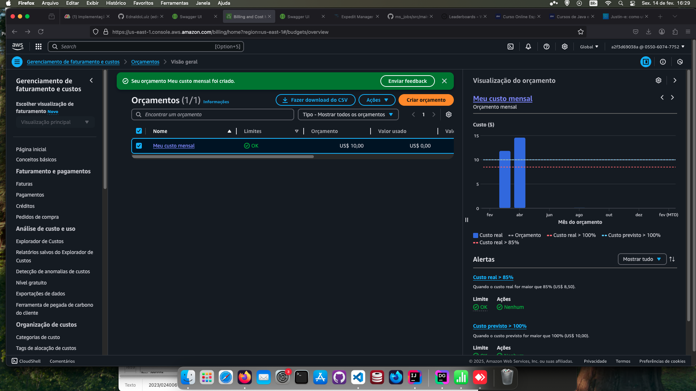

<h1 align=center>AWS Budgets - Criando um alerta de Budget no console de Billing</h1>

<h2>Arquitetura do laboratório</h2>

    

<h2> Conteúdo do laboratório </h2>

Neste laboratório você irá aprender criar um alerta de Orçamento personalizado para rastrear seus custos utilizando o AWS Budgets.

<h2>Tarefas a serem executadas</h2>

1. Acessar a console de gerenciamento do AWS.
2. Criar e configurar um alerta de Budget na console de Billing.

<h2>Resultado</h2>

    

