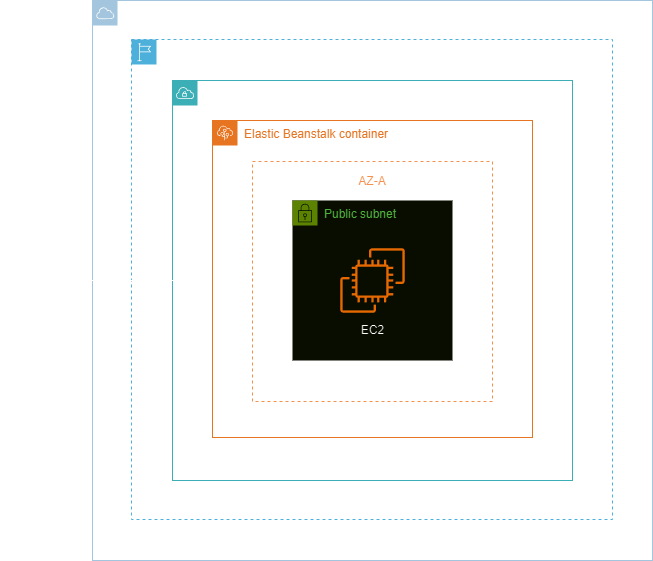
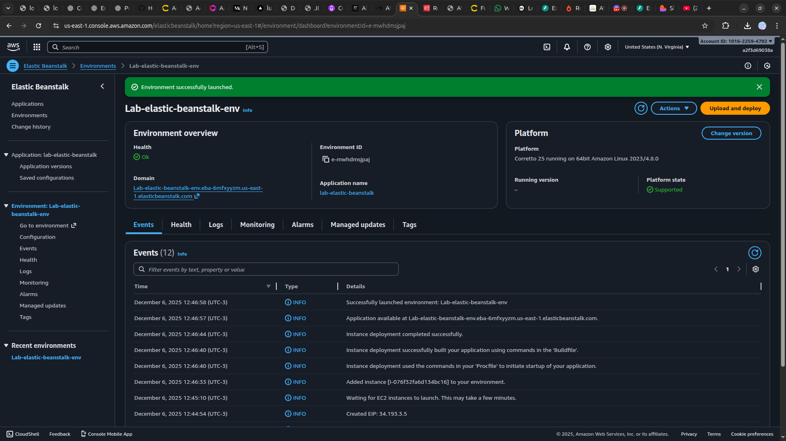
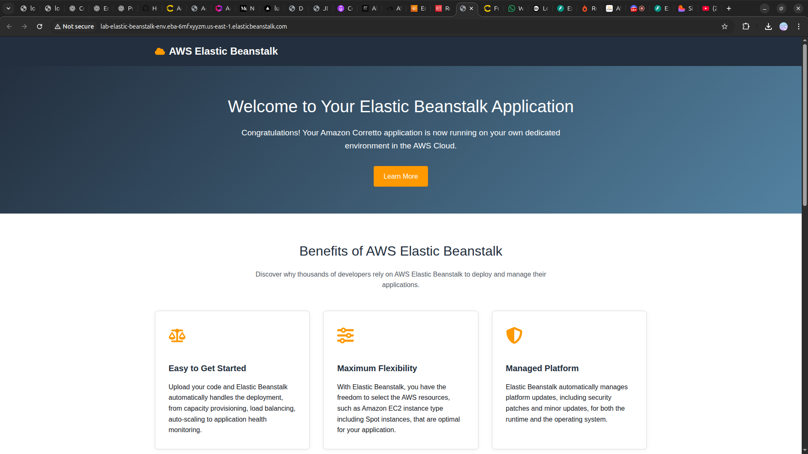

<h1 align=center> AWS Elastic Beanstalk - Provisionando sua primeira aplicação </h1>

    

<h2> AWS Elastic Beanstalk </h2>

O AWS Elastic Beanstalk é um serviço de implantação e gerenciamento de aplicações da Amazon Web Services que facilita a configuração, o monitoramento e a escalabilidade de aplicativos web e serviços, desenvolvidos em diversas linguagens como Java, .NET, PHP, Node.js, Python, Ruby, Go e Docker. Ele permite que desenvolvedores façam upload de seu código e automaticamente lida com a implantação, do provisionamento da capacidade e balanceamento de carga à escalabilidade automática e monitoramento de desempenho. O Elastic Beanstalk integra-se perfeitamente com outras ferramentas AWS, proporcionando um ambiente altamente disponível e de alta performance, sem a necessidade de gerenciar a infraestrutura subjacente, permitindo aos desenvolvedores focarem na escrita de código.

<h2> Conteúdo do laboratório </h2>

Neste laboratório, você irá aprender a criar uma função usando uma política gerenciada pela AWS e a provisionar uma aplicação web com o Elastic Beanstalk.

<h2>Tarefas a serem executadas</h2>

1. Acesse a console de gerenciamento da AWS.
2. Crie uma role (função) usando uma política gerenciada pela AWS.
3. Crie um ambiente do Elastic Beanstalk.

<h2>Resultado</h2>

    

    

