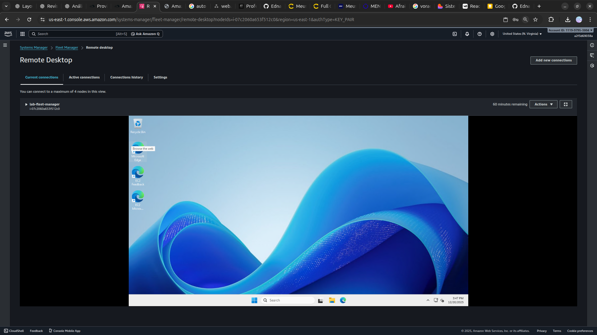

<h1 align=center> Amazon EC2 - Acessando máquina Windows com o Fleet Manager </h1>

<h2> AWS System Manager Fleet Manager </h2>

O Fleet Manager, um recurso do AWS Systems Manager, é uma experiência de interface de usuário unificada (UI) que ajuda você a gerenciar remotamente os nós em execução na AWS ou on-premises. Com Fleet Manager, você pode visualizar o status de integridade e a performance de toda a sua frota de servidores em um console. Você também pode coletar dados de nós individuais para executar tarefas comuns de solução de problemas e gerenciamento. Com o Fleet Manager, os usuários podem centralizar e visualizar informações críticas sobre suas instâncias, facilitando a tomada de decisões informadas. O Fleet Manager oferece uma administração segura e simplificada de ambientes na nuvem da AWS.

<h2> Conteúdo do laboratório </h2>

Neste laboratório, aprenderemos a criar uma instância EC2, criaremos uma função do IAM, associando-a à instância, para permitir o acesso do Fleet Manager à instância EC2, eliminando a necessidade de liberação da porta RDP.

<h2>Tarefas a serem executadas</h2>

1. Crie uma VPC
2. Criar uma IAM Role (função)
3. Crie uma EC2
4. Acesse a EC2 via Fleet Manager

<h2>Resultado</h2>

    

    

