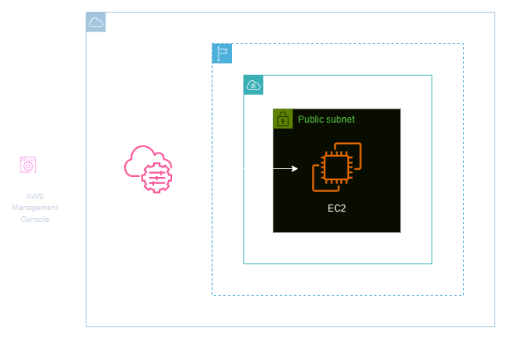
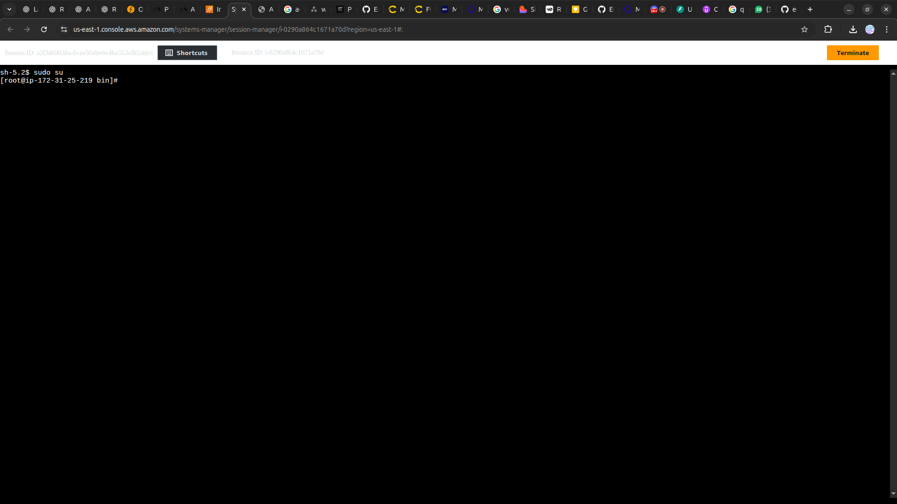

<h1 align=center>  Amazon EC2 - Acessando uma EC2 Linux via AWS Systems Manager </h1>

    

<h2> AWS Systems Manager </h2>

O AWS Systems Manager é uma solução abrangente da Amazon Web Services (AWS) que simplifica a gestão de infraestrutura em escala. Permitindo aos usuários automatizar tarefas operacionais, realizar inventários detalhados, aplicar patches de segurança, além de monitorar e solucionar problemas em ambientes AWS.

Com recursos como o Session Manager, que facilita o acesso seguro e sem a necessidade de SSH a instâncias EC2, o AWS Systems Manager proporciona uma abordagem centralizada e eficiente para gerenciar recursos na nuvem, garantindo a conformidade e melhorando a eficiência operacional.

<h2> Conteúdo do laboratório </h2>

Neste laboratório, aprenderemos a acessar uma instância EC2 por meio do AWS Systems Manager, estabelecendo a conexão sem a necessidade de utilizar SSH ou chave de acesso.

<h2>Tarefas a serem executadas</h2>

1. Acesse a console de gerenciamento da AWS.
2. Crie uma Role (Função) do IAM
3. Crie uma instância EC2
4. Acesse a Instância via AWS Systems Manager Session Manager

<h2>Resultado</h2>

    

