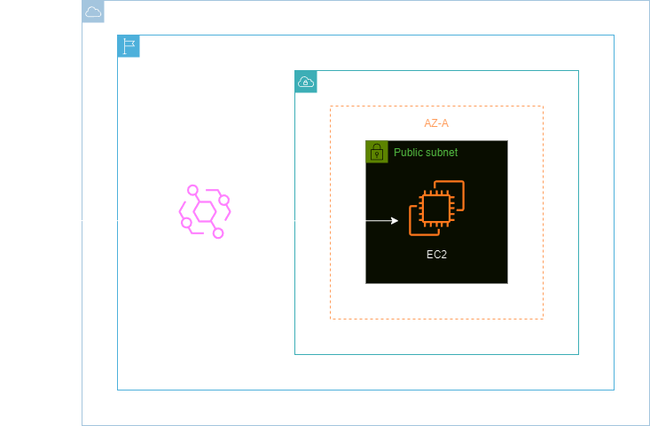
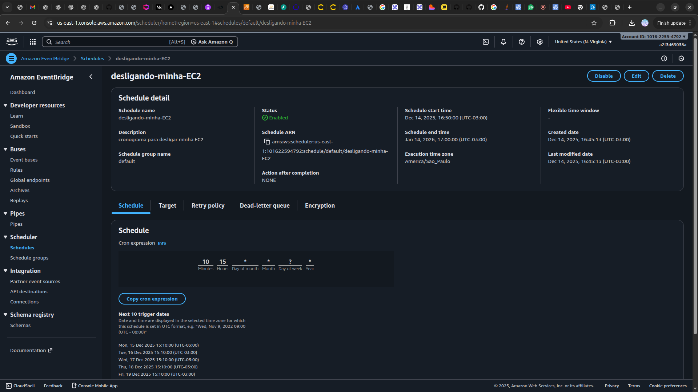
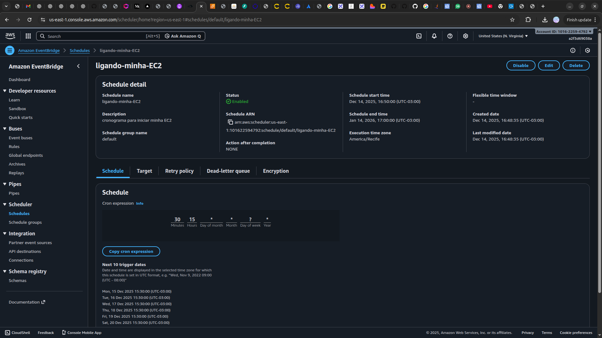

<h1 align=center>Amazon EC2 - Agendando ligar e desligar instância com Amazon EventBridge </h1>

    

<h2> Amazon EventBridge </h2>

O Amazon EventBridge é um serviço de barramento de eventos totalmente gerenciado pela Amazon Web Services (AWS). Ele permite a criação, entrega e recebimento de eventos entre diferentes aplicativos ou serviços em tempo real. O EventBridge simplifica a arquitetura de microsserviços, facilitando a integração de eventos em uma variedade de fontes, como aplicativos SaaS, serviços da AWS e sistemas personalizados.

Com suporte para padrões de eventos comuns e uma estrutura de regras flexível, o Amazon EventBridge oferece uma solução escalável e eficiente para a construção de arquiteturas orientadas a eventos na nuvem, promovendo a interoperabilidade e a automação de fluxos de trabalho complexos.

<h2> Conteúdo do laboratório </h2>

Neste laboratório você irá aprender a realizar o agendamento para ligar e desligar uma instância EC2 com o Amazon EventBridge.

<h2>Tarefas a serem executadas</h2>

1. Acesse a console de gerenciamento da AWS.
2. Acesse o serviço do AWS IAM.
3. Crie a instância EC2 para realizar o agendamento.
4. Crie o agendamento para interromper a instância criada.
5. Crie o agendamento para iniciar a instância interrompida.
6. Verifique o agendamento de interromper / iniciar a instância EC2.

<h2>Resultado</h2>

    

    

