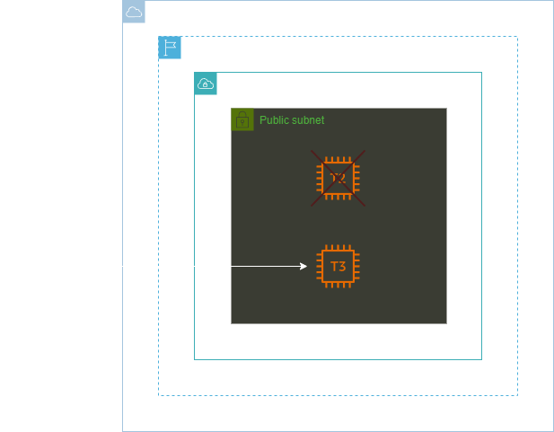
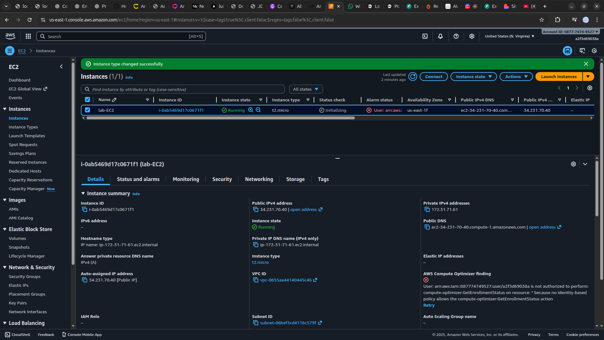

<h1 align=center> Amazon EC2 - Alterando tipo da instância (redimensionamento) </h1>

    

<h2> Amazon EC2 (Elastic Compute Cloud) </h2>

O Amazon EC2 (Elastic Compute Cloud) oferece escalabilidade e flexibilidade para ajustar os recursos de computação conforme necessário. Alterar o tipo de instância no Amazon EC2 pode melhorar significativamente a eficiência e reduzir custos ao alinhar a capacidade de computação com as demandas reais da aplicação.  Essa capacidade de ajustar o tipo de instância conforme as necessidades da aplicação permitem uma gestão mais eficaz dos recursos e do orçamento, mantendo a operação otimizada e econômica.

<h2> Conteúdo do laboratório </h2>

Neste laboratório iremos realizar o redimensionamento da instância EC2.

<h2>Tarefas a serem executadas</h2>

1. Acesse a console de gerenciamento da AWS.
2. Crie uma instância EC2.
3. Altere o tipo da Instância EC2.

<h2>Resultado</h2>

    

