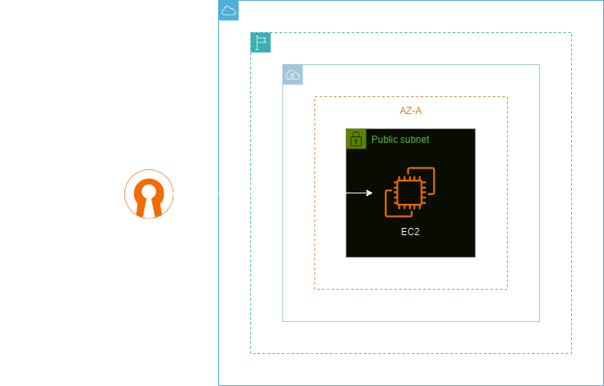
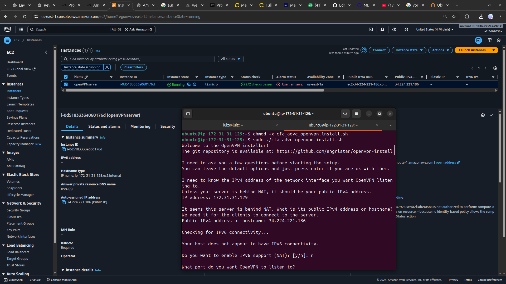

<h1 align=center> Amazon EC2 - Configurando OpenVPN Server em uma EC2 Linux </h1>

    

<h2> Amazon EC2 </h2>

O Amazon EC2 é um serviço de computação em nuvem oferecido pela AWS que permite a criação e o gerenciamento de servidores virtuais na nuvem. Com o EC2, os usuários podem configurar instâncias de servidores de acordo com suas necessidades computacionais, escolhendo capacidade de processamento, memória, armazenamento e sistema operacional.

O OpenVPN é uma solução de software de código aberto que utiliza técnicas de rede privada virtual (VPN) para criar conexões seguras e encriptadas através da internet. Ao utilizar o OpenVPN, as empresas podem manter uma comunicação segura com seus serviços e recursos na nuvem, assegurando a integridade e a confidencialidade das informações críticas durante a transferência, o que é vital para proteger operações sensíveis e dados corporativos em ambientes cada vez mais distribuídos e baseados em nuvem.

<h2> Conteúdo do laboratório </h2>

Neste laboratório iremos aprender a implementar na prática um servidor de OpenVPN em uma EC2 Linux.

<h2>Tarefas a serem executadas</h2>

1. Acesse a console de gerenciamento da AWS.
2. Crie uma instância EC2 Linux.
3. Instale o OpenVPN na instância EC2.
4. Libere a porta do OpenVPN Server no security group.
5. Feche a VPN.

<h2>Resultado</h2>

    

