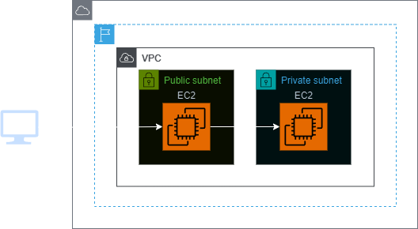
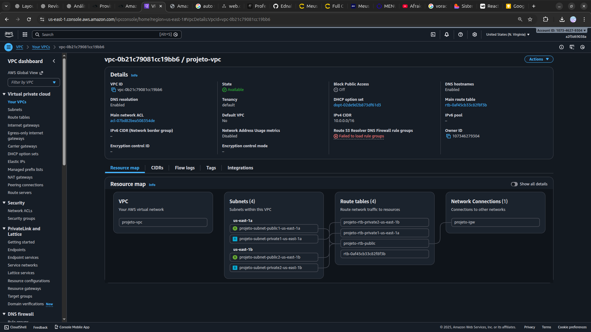
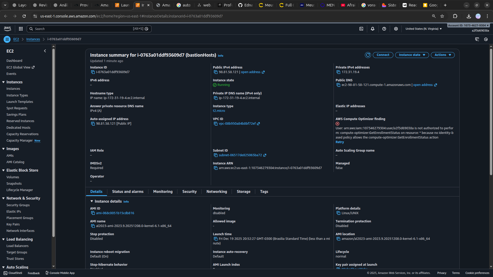

<h1 align=center> Amazon EC2 - Configurando comunicação segura entre duas instâncias </h1>

    

<h2> Grupos De Segurança </h2>

Na Amazon Web Services (AWS), os grupos de segurança são um componente fundamental para o gerenciamento da segurança de instâncias dentro de uma Virtual Private Cloud (VPC). Cada instância em uma VPC pode ser associada a um ou mais grupos de segurança, que atuam como firewalls virtuais, controlando o tráfego de entrada e saída. Esses grupos são configurados com regras que especificam quais tipos de tráfego são permitidos ou negados. As regras do grupo de segurança são baseadas em portas e protocolos, permitindo um controle granular sobre o acesso à instância. Essa abordagem de segurança baseada em grupos simplifica a administração, pois as regras são aplicadas automaticamente a todas as instâncias associadas ao grupo. Além disso, as alterações nas configurações dos grupos de segurança são refletidas instantaneamente, proporcionando uma segurança dinâmica e flexível para ambientes na nuvem.

<h2> Conteúdo do laboratório </h2>

Neste laboratório, iremos aprender a criar uma instância de bastion host para possibilitar a comunicação com uma instância em uma subnet privada, liberando a comunicação da instância na subnet privada apenas para o grupo de segurança da instância do bastion host.

<h2>Tarefas a serem executadas</h2>

1 - Acesse o Console de Gerenciamento da AWS
2 - Crie uma VPC
3 - Crie os Securitys Groups (SG) para suas instâncias EC2
4 - Iniciando instância EC2 Bastion Hosts
5 - Iniciando minnha Segunda instância EC2
6 - Acesso as instâncias EC2 utilizando o agente SSH 

<h2>Resultado</h2>

    

div align=center>
    

