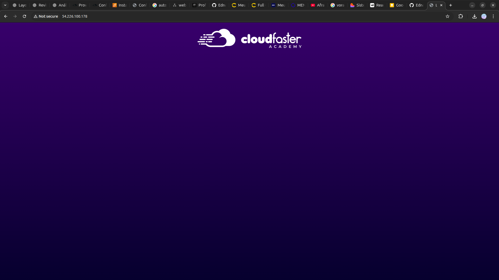

<h1 align=center> Configurando scripts na inicialização de uma EC2 </h1>

<h2> Amazon EC2 </h2>

O Amazon EC2 é um serviço de computação em nuvem oferecido pela AWS que permite a criação e o gerenciamento de servidores virtuais na nuvem. Com o EC2, os usuários podem configurar instâncias de servidores de acordo com suas necessidades computacionais, escolhendo capacidade de processamento, memória, armazenamento e sistema operacional.

<h2> User Data (dados do usuário) </h2>

Os "User Data" (dados do usuário) em instâncias EC2 da AWS são uma funcionalidade crucial que permite a execução de scripts de inicialização durante o lançamento da instância. Esses scripts podem conter comandos e configurações personalizadas que automatizam tarefas específicas, como a instalação de software, configuração de serviços, ajuste de parâmetros do sistema e muito mais. Ao incluir scripts no User Data, os administradores podem criar ambientes personalizados e otimizados para suas necessidades, garantindo que as instâncias EC2 sejam provisionadas exatamente da maneira desejada. 

<h2> User Data (dados do usuário) </h2>

Neste laboratório, iremos aprender a subir uma instância EC2, utilizando a função "user data" para automatizar e personalizar o processo de inicialização.

<h2>Tarefas a serem executadas</h2>

1. Faça login na console de gerenciamento da AWS.
2. Inicie sua primeira instância EC2 com script bash.

<h2>Resultado</h2>

    

