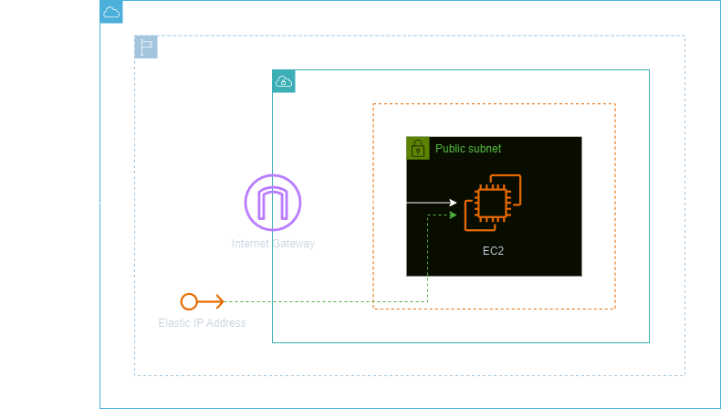
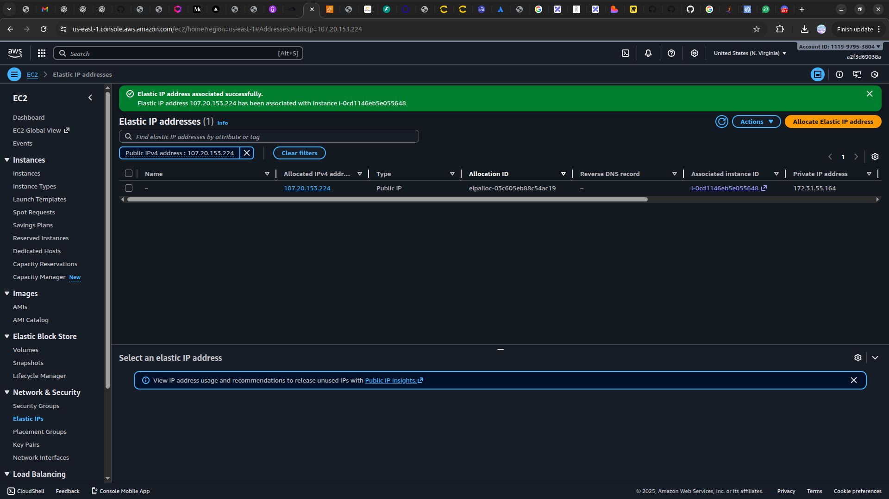

<h1 align=center> Elastic IP addresses - Criando e utilizando meu primeiro EIP (Elastic IP) </h1>

    

<h2> Endereço IP elástico (Elastic IP Address) </h2>

O endereço IP elástico é um endereço IPv4 estático projetado para computação em nuvem dinâmica. Um endereço IP elástico é alocado para sua conta da AWS, será seu até que você o libere novamente. Com um endereço IP elástico, é possível mascarar a falha de uma instância ou software re-mapeando rapidamente o endereço para outra instância na conta, na mesma região. É possível especificar o endereço IP elástico em um registro DNS para o seu domínio, permitindo que este direcione para a instância correspondente, quando acionado.

<h2> Conteúdo do laboratório </h2>

Neste laboratório você aprenderá a alocar um endereço IP elástico e associá-lo a uma instância EC2.
<h2>Tarefas a serem executadas</h2>

1. Acesse o Console de Gerenciamento da AWS.
2. Crie uma instância EC2.
3. Reinicie sua máquina.
4. Crie um Elastic IP.

<h2>Resultado</h2>

    

