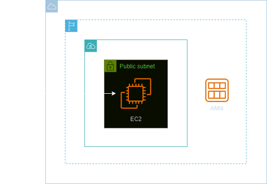
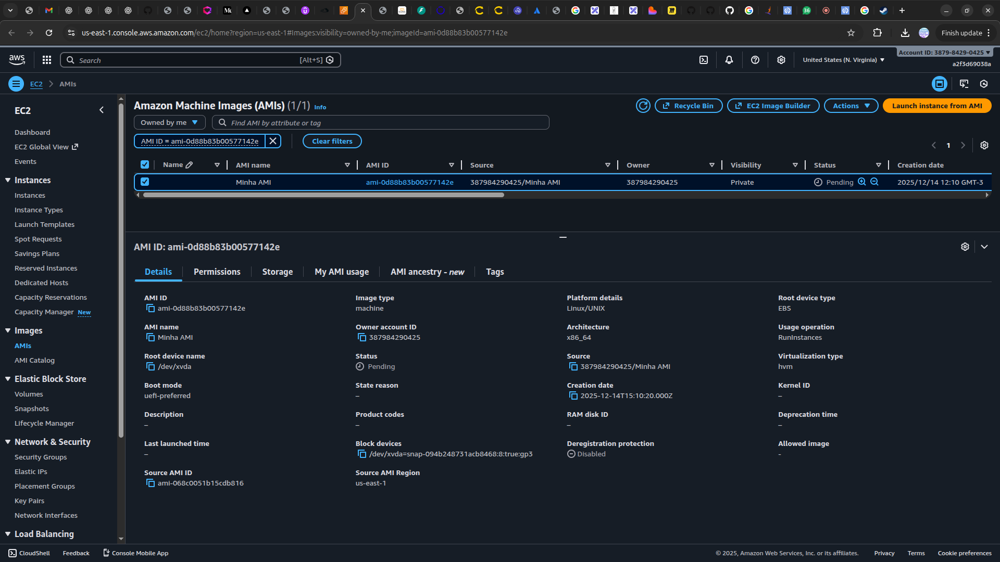

<h1 align=center> Amazon EC2 - Criando minha primeira AMI </h1>

    

<h2> Amazon Machine Images (AMIs) </h2>

As Amazon Machine Images (AMIs) da AWS desempenham um papel fundamental na flexibilidade e escalabilidade dos ambientes de computação em nuvem. Uma AMI é essencialmente uma imagem pré-configurada que inclui um sistema operacional, software de aplicação e quaisquer configurações necessárias. Essas imagens servem como modelos para criar instâncias EC2, permitindo a replicação consistente de ambientes personalizados.

Com as AMIs, os usuários podem capturar e preservar configurações específicas, acelerando o processo de implantação, garantindo a consistência operacional e facilitando a recuperação de instâncias em caso de falhas. Essa funcionalidade é crucial para otimizar o ciclo de vida das instâncias EC2 e proporcionar uma infraestrutura ágil e adaptável às necessidades dinâmicas da computação em nuvem.

<h2> Conteúdo do laboratório </h2>

Neste laboratório, você irá aprender a criar uma Imagem de Máquina da Amazon (AMI) a partir de uma instância EC2.

<h2>Tarefas a serem executadas</h2>

1. Acesse a console de gerenciamento da AWS.
2. Crie uma instância EC2.
3. Crie uma AMI.

<h2>Resultado</h2>

    

