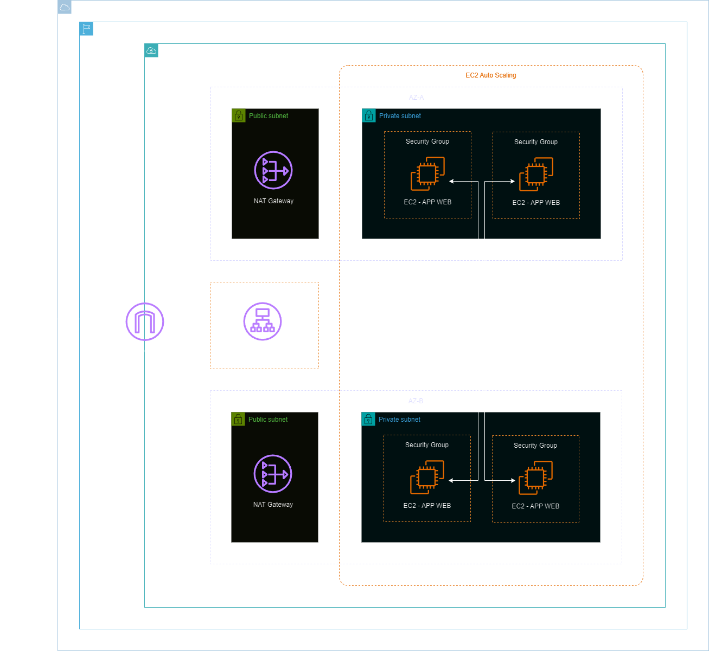
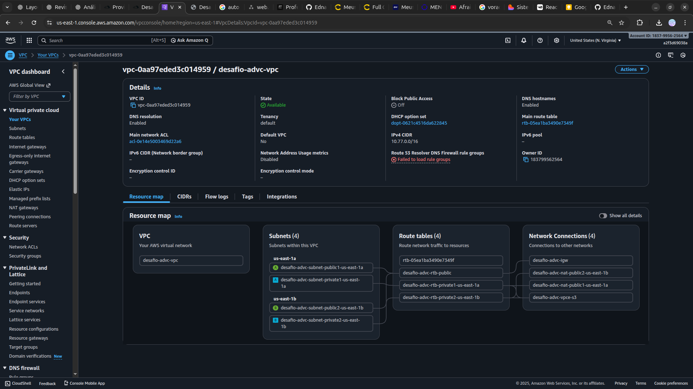
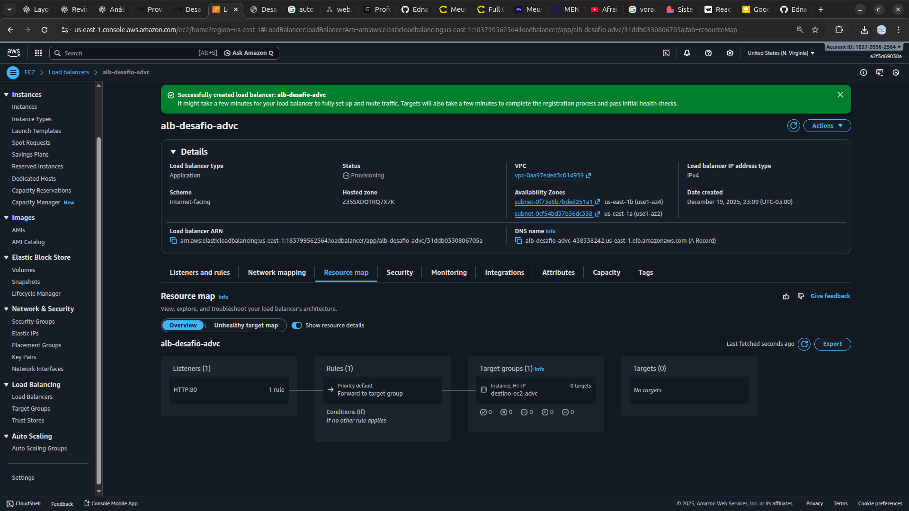
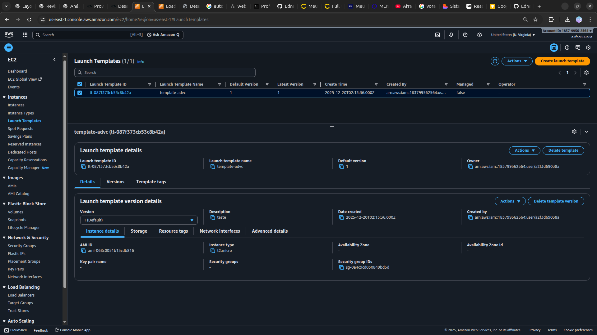
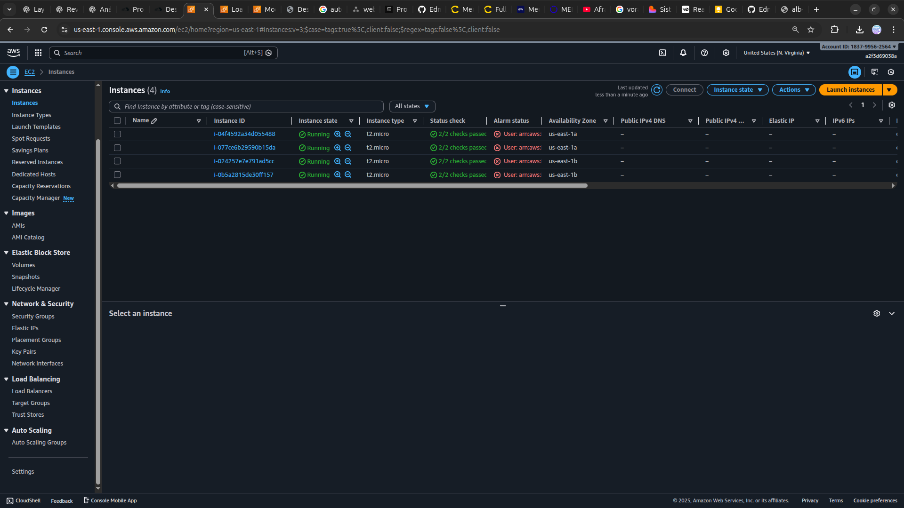

<h1 align=center> Desafio da Alta Disponibilidade com EC2 + ALB + EC2 Auto Scaling </h1>

    

<h2> Amazon EC2 </h2>

O Amazon Elastic Compute Cloud (Amazon EC2) oferece a plataforma de computação mais ampla e aprofundada, com mais de 750 instâncias e opções de processadores, armazenamentos, redes, sistemas operacionais e modelos de compras mais recentes para ajudar você a atender melhor as necessidades do seu workload.

<h2> Application Load Balancer (ALB) </h2>

O ALB (Application Load Balancer) da AWS é um serviço de balanceamento de carga altamente disponível e escalável, projetado para distribuir o tráfego de aplicativos em várias instâncias EC2 ou contêineres ECS. Ele opera no nível de aplicativo (camada 7) do Modelo OSI, permitindo roteamento inteligente com base em informações do conteúdo HTTP/HTTPS. Com o ALB, é possível criar regras sofisticadas para direcionar o tráfego para diferentes destinos com base em caminhos de URL, cabeçalhos HTTP, métodos de solicitação e até mesmo condições personalizadas. Isso o torna ideal para ambientes com várias aplicações, microserviços ou arquiteturas de contêineres.

<h2> Auto Scaling </h2>

Os grupos do Auto Scaling da AWS é uma ferramenta fundamental para otimizar a escalabilidade e a resiliência em ambientes de nuvem. Este recurso permite a automação da adição ou remoção de instâncias EC2 conforme a demanda da aplicação. Ao configurar políticas baseadas em métricas específicas, como CPU ou utilização de recursos, o Auto Scaling garante que o número de instâncias esteja sempre alinhado com as necessidades do sistema. Além disso, o Auto Scaling pode ser integrado a um balanceador de carga, o Elastic Load Balancer (ELB), para distribuir o tráfego de maneira uniforme e manter a alta disponibilidade da aplicação.

<h2> Conteúdo do laboratório </h2>

Neste laboratório, você terá acesso a uma conta real da AWS para provisionar uma aplicação web, como parte das atividades do Desafio Arquiteto de Valor Cloud. Além disso, você aprenderá a trabalhar com os serviços da AWS como o Amazon VPC, Amazon EC2, Security Groups, Balanceadores de Carga (ALB) e EC2 Auto Scaling. Todos estes serviços utilizados em conjunto, para provisionar uma aplicação web com segurança, alta disponibilidade, escalabilidade e custo eficiente.

<h2>Tarefas a serem executadas</h2>

1. Acesse a console de gerenciamento da AWS.
2. Crie uma VPC e grupos de segurança.
3. Crie um grupo de destino e um balanceador de carga.
4. Crie um modelo de execução e um grupo do auto scaling.
5. Teste o seu ALB.

<h2>Resultado</h2>

    

    

    

    

