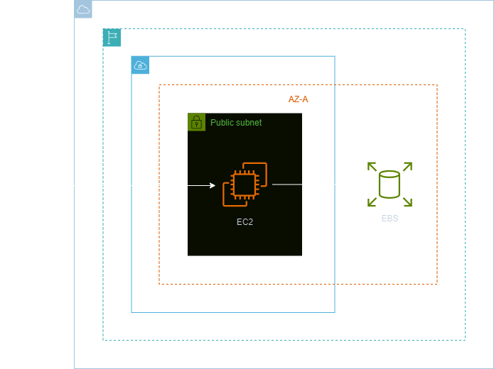
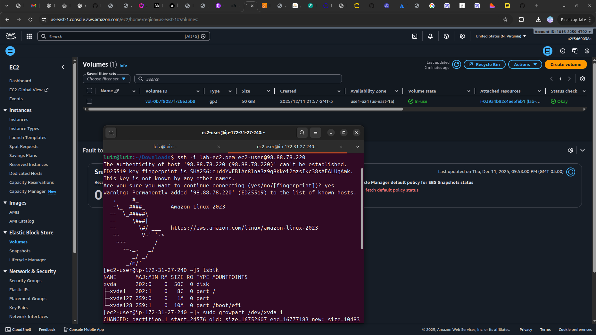

<h1 align=center> Amazon EC2 - Expandindo um EBS em uma EC2 Linux </h1>

    

<h2> Amazon EC2 </h2>

O Amazon EC2 é um serviço de computação em nuvem oferecido pela AWS que permite a criação e o gerenciamento de servidores virtuais na nuvem. Com o EC2, os usuários podem configurar instâncias de servidores de acordo com suas necessidades computacionais, escolhendo capacidade de processamento, memória, armazenamento e sistema operacional.

<h2> Amazon Elastic Block Store (EBS) </h2>

O Amazon Elastic Block Store (Amazon EBS) é um serviço de armazenamento em blocos fácil de usar, escalável e de alta performance projetado para o Amazon Elastic Compute Cloud (Amazon EC2). 

<h2> Conteúdo do laboratório </h2>

Neste laboratório iremos aprender como expandir um volume EBS em uma instância EC2 Linux.

<h2>Tarefas a serem executadas</h2>

1. Acesse a console de gerenciamento da AWS.
2. Crie uma instância EC2.
3. Expanda seu volume EBS na console.
4. Acesse a instância via terminal SSH no Linux ou via PuTTY.
6. Expanda seu EBS.
7. Verifique o volume foi expandido.

<h2>Resultado</h2>

    

