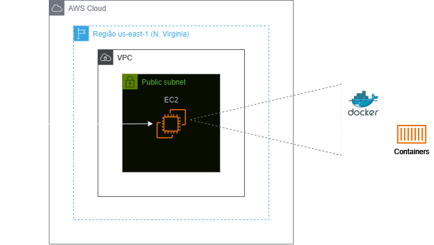
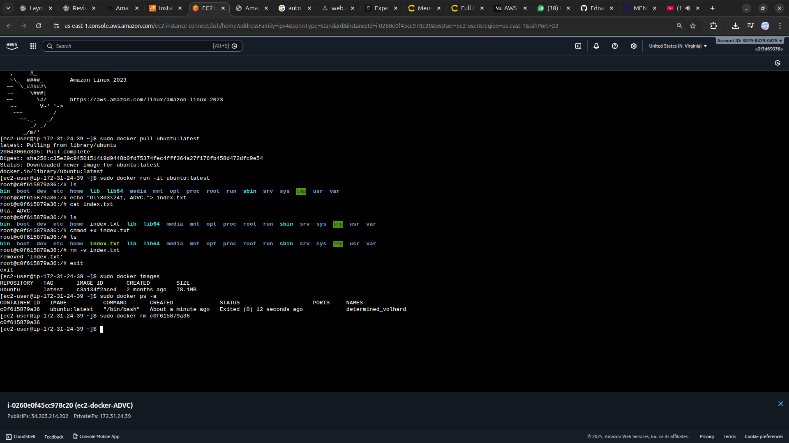

<h1 align=center> Amazon EC2 - Instalando e configurando o Docker em uma instância </h1>

    

<h2> Amazon EC2 </h2>

O Amazon EC2 é um serviço de computação em nuvem oferecido pela AWS que permite a criação e o gerenciamento de servidores virtuais na nuvem. Com o EC2, os usuários podem configurar instâncias de servidores de acordo com suas necessidades computacionais, escolhendo capacidade de processamento, memória, armazenamento e sistema operacional.

<h2> Docker </h2>

O Docker é uma plataforma de código aberto que automatiza a implantação, escala e execução de aplicações por meio de contêineres. Esses contêineres encapsulam uma aplicação e suas dependências, garantindo que ela funcione de maneira consistente em qualquer ambiente, seja no desenvolvimento, teste ou produção. Ao utilizar contêineres leves e isolados, o Docker proporciona eficiência, portabilidade e segurança, permitindo que desenvolvedores e equipes de operações colaborem mais efetivamente. Com o Docker, é possível melhorar a velocidade de desenvolvimento, reduzir conflitos entre ambientes e otimizar o uso de recursos de infraestrutura.

<h2> Conteúdo do laboratório </h2>

Neste laboratório, você aprenderá a realizar o provisionamento de instâncias EC2 na Amazon Web Services (AWS) e a instalar o Docker automaticamente por meio de um script de inicialização.

<h2>Tarefas a serem executadas</h2>

1 - Crie uma EC2 e instalar o Docker utilizando User data (Dados do usuário)
2 - Lançando um container Docker com uma imagem do Ubuntu
3 - Parando e Removendo o Docker Container

<h2>Resultado</h2>

    

