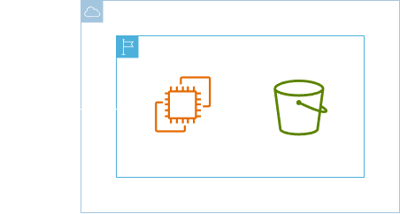
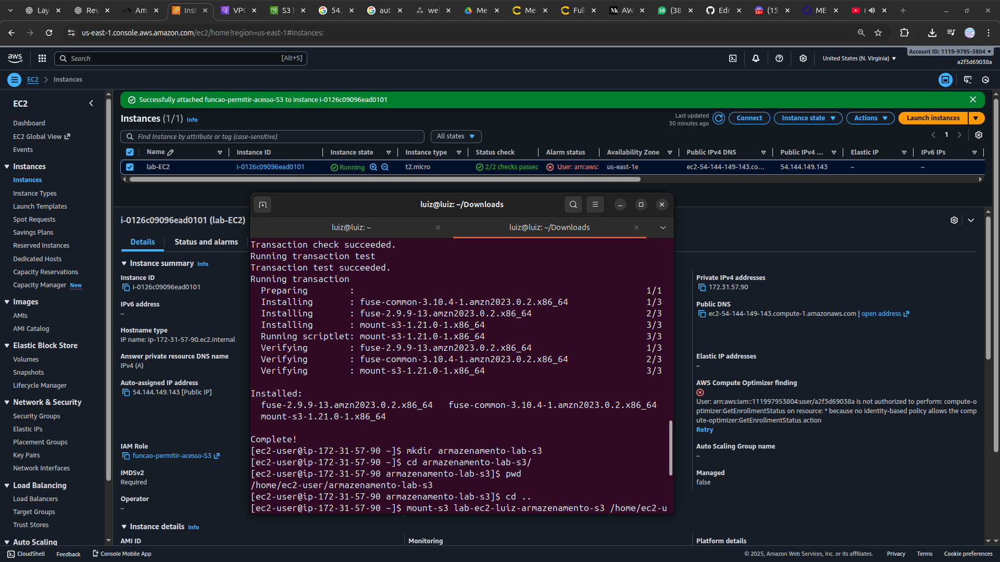

<h1 align=center> Amazon EC2 - Montando um Bucket do S3 em uma instância EC2 Linux </h1>

    

<h2> Amazon EC2 </h2>

O Amazon EC2 é um serviço de computação em nuvem oferecido pela AWS que permite a criação e o gerenciamento de servidores virtuais na nuvem. Com o EC2, os usuários podem configurar instâncias de servidores de acordo com suas necessidades computacionais, escolhendo capacidade de processamento, memória, armazenamento e sistema operacional.

<h2> Amazon S3 </h2>

O Amazon Simple Storage Service (Amazon S3) é um serviço de armazenamento de objetos que oferece escalabilidade, disponibilidade de dados, segurança e performance líderes do setor. Clientes de todos os portes e setores podem armazenar e proteger qualquer quantidade de dados de praticamente qualquer caso de uso, como data lakes, aplicações nativas da nuvem e aplicações móveis. Com classes de armazenamento econômicas e recursos de gerenciamento fáceis de usar, você pode otimizar custos, organizar dados e configurar controles de acesso ajustados para atender a requisitos específicos de negócios, organizacionais e de conformidade.

<h2> Conteúdo do laboratório </h2>

Neste laboratório iremos aprender a como montar um bucket do S3, com um volume em uma EC2 Linux.

<h2>Tarefas a serem executadas</h2>

1. Faça login na console de gerenciamento AWS.
2. Acesse o AWS IAM e crie uma política.
3. Crie uma função.
4. Crie uma instância EC2.
5. Crie um bucket no Amazon S3.
6. Adicione uma função a instância EC2.
7. Monte o Amazon S3 na EC2.

<h2>Resultado</h2>

    

