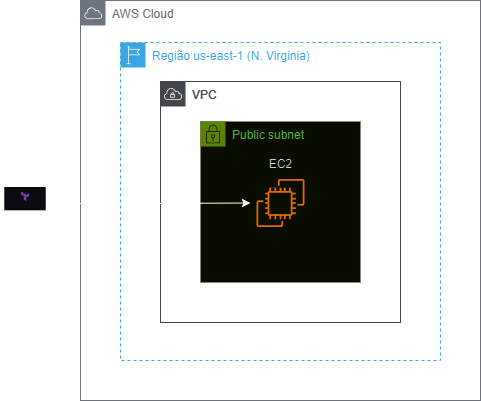
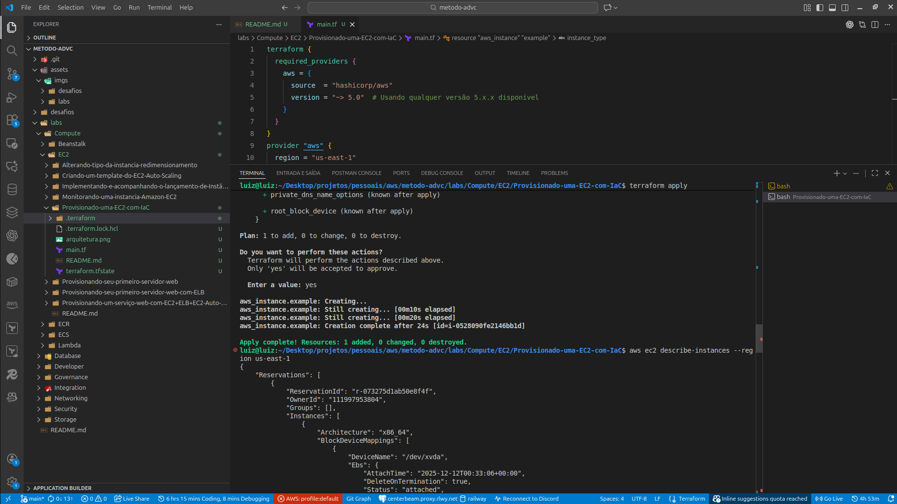

<h1 align=center> Terraform - Provisionado uma EC2 com IaC </h1>

    

<h2> Terraform </h2>

O Terraform é uma ferramenta de infraestrutura como código desenvolvida pela HashiCorp, que permite aos usuários definir e provisionar data centers utilizando uma linguagem de configuração declarativa. Com o Terraform, você pode criar, gerenciar e versionar recursos de infraestrutura de maneira eficiente e automatizada. Ele suporta múltiplos provedores de serviços de nuvem, como AWS, Azure e Google Cloud, facilitando a implementação de infraestruturas híbridas e multi-cloud. A abordagem declarativa do Terraform garante consistência e previsibilidade nas implementações, enquanto seus recursos de planejamento e visualização de mudanças ajudam a evitar problemas antes da aplicação.

O Terraform pode simplificar significativamente o gerenciamento de instâncias EC2 ao permitir que você defina, provisionar e gerencie suas instâncias de forma automatizada e repetível utilizando arquivos de configuração de infraestrutura como código (IaC). Com o Terraform, você pode versionar suas configurações, facilitando a rastreabilidade e auditoria das mudanças na infraestrutura, além de poder aplicar, atualizar ou destruir instâncias de EC2 de maneira consistente e previsível. Sua capacidade de planejar mudanças antes de aplicá-las ajuda a minimizar erros e a garantir que a infraestrutura atenda exatamente às especificações desejadas.

<h2> Conteúdo do laboratório </h2>

Neste laboratório você aprenderá a utilizar uma AMI para provisionar uma instância EC2 ultizando o Terraform.

<h2>Tarefas a serem executadas</h2>

1 - Criar um Diretório para o Laboratório
2 - Configure suas credenciais do CLI
3- Crie um arquivo de configuração Terraform (.tf)
4 - Criar um EC2 utilizando Terraform
5 - Destruir sua EC2

<h2>Resultado</h2>

    

