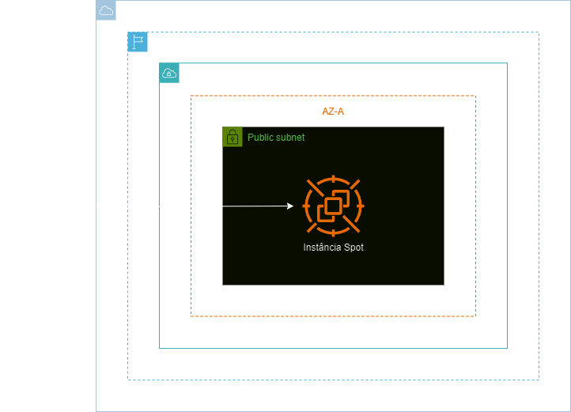
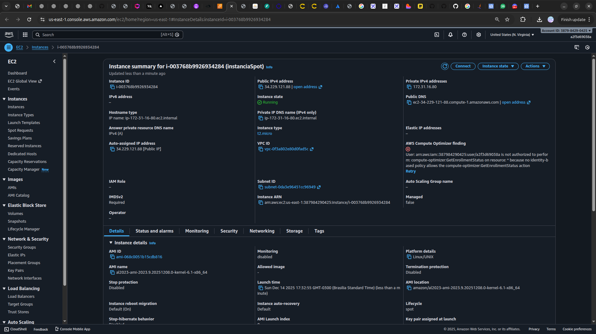

<h1 align=center> Amazon EC2 - Provisionando minha primeira instância SPOT </h1>

    

<h2> Instâncias Spot do Amazon EC2 </h2>

As instâncias spot do Amazon EC2 oferecem uma opção econômica para executar cargas de trabalho flexíveis e tolerantes a falhas, na AWS. Essas instâncias são adquiridas por meio de um mercado de spot, onde os preços são determinados pela oferta e demanda. Como resultado, os preços das instâncias spot podem variar ao longo do tempo, mas geralmente são significativamente mais baixos do que os preços das instâncias sob demanda.

Isso torna as spot instances (instâncias spot) ideais para cargas de trabalho que podem ser interrompidas sem um impacto significativo, como análise de big data, processamento de lotes, renderização de vídeos e testes de aplicativos em grande escala. Ao usá-las, os usuários podem economizar custos significativos sem comprometer a qualidade ou a eficiência de suas cargas de trabalho.

<h2> Conteúdo do laboratório </h2>

Neste laboratório iremos aprender a como subir uma instância spot do Amazon EC2 e validá-la. 

<h2>Tarefas a serem executadas</h2>

1. Acesse a console de gerenciamento da AWS.
2. Crie uma instância spot do Amazon EC2.
3, Valide a instância spot criada.

<h2>Resultado</h2>

    

    

    

