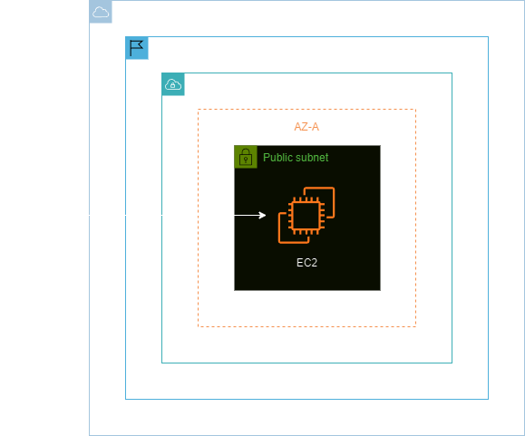

<h1 align=center> Amazon EC2 - Recuperar acesso a uma instância sem chave ssh (.pem) </h1>

    

<h2> Pares de chaves do Amazon EC2 e instâncias do Linux </h2>

Um par de chaves, que consiste em uma chave pública e uma chave privada, trata-se de um conjunto de credenciais de segurança usadas para provar sua identidade ao se conectar a uma instância do Amazon EC2. O Amazon EC2 armazena a chave pública na instância, e você armazena a chave privada. Para instâncias do Linux, a chave privada permite usar o SSH com segurança na instância. 

Observação: qualquer pessoa que tenha a sua chave privada pode se conectar a suas instâncias. Por isso é importante que você armazene a chave privada em um lugar seguro.

<h2> Conteúdo do laboratório </h2>

Neste laboratório, iremos aprender a criar uma instância EC2 em uma subnet pública, realizar o acesso à EC2 via terminal Linux, criar uma nova chave de acesso, listar a chave pública utilizando o terminal do Linux, utilizar o script de inicialização para inserir uma nova chave de acesso na EC2 e validar o acesso novamente.

<h2>Tarefas a serem executadas</h2>

1. Acesse a console de gerenciamento da AWS.
2. Crie uma instância EC2.
3. Acesse a instância via terminal SSH no Linux.
4. Crie um par de chaves.
5. Valide o acesso com seu novo par de chaves.

<h2>Resultado</h2>

    

