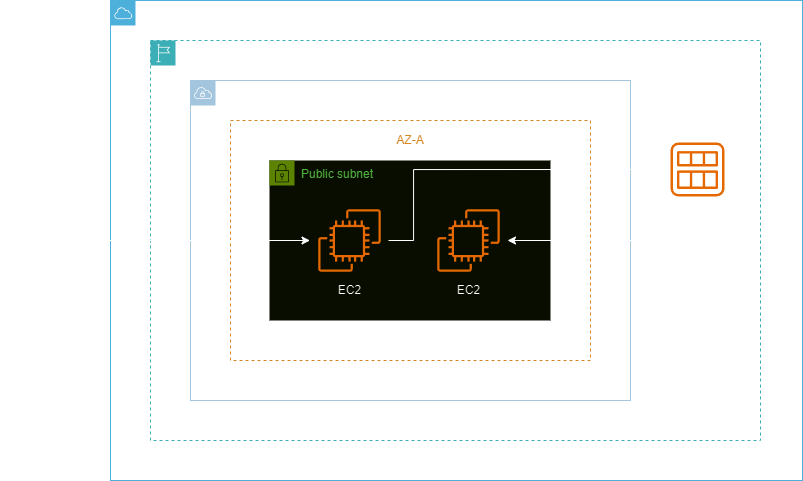
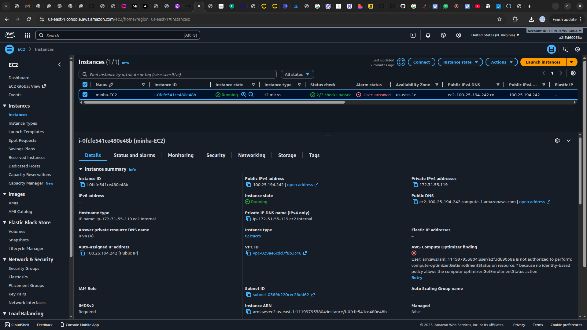

<h1 align=center> Amazon EC2 - Subindo uma EC2 através de uma AMI </h1>

    

<h2> Imagens de máquina da Amazon (AMI) </h2>

Uma Imagem de Máquina da Amazon (AMI) é um modelo que contém as informações necessárias para iniciar uma instância EC2. Ela inclui um ou mais snapshots do EBS, permissões de execução e um mapeamento de dispositivos de bloco. Você pode usar uma AMI existente, personalizar a instância e salvar essa configuração como uma AMI personalizada. As AMIs podem ser públicas, privadas ou compartilhadas com contas específicas. A Amazon oferece o Amazon Linux 2023, uma AMI otimizada para o EC2, sem custo adicional.

<h2> Conteúdo do laboratório </h2>

Neste laboratório iremos criar uma Instância, criar uma AMI a partir da Instância e subir uma nova instância com a AMI criada.

<h2>Tarefas a serem executadas</h2>

1. Acesse o console AWS.
2. Crie uma EC2.
3. Crie uma EC2 a partir da AMI criada.

<h2>Resultado</h2>

    

