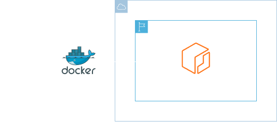
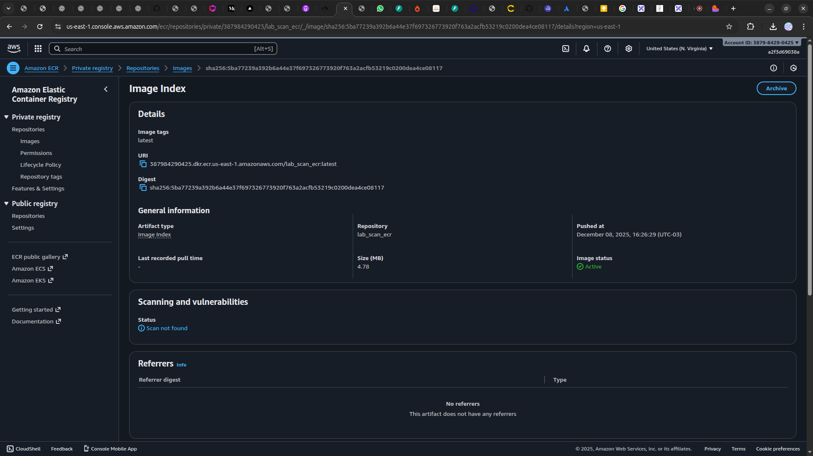

<h1 align=center> Amazon ECR - Aplicando segurança nas imagens Docker </h1>

    

<h2> Amazon Elastic Container Registry (ECR) </h2>

Amazon Elastic Container Registry (ECR) é um registro de container totalmente gerenciado que oferece hospedagem de alta performance para que você possa implantar imagens e artefatos de aplicações de forma confiável em qualquer lugar.

<h2> Conteúdo do laboratório </h2>

Neste laboratório iremos aprender a implementar na prática a subir uma imagem Docker para o Amazon ECR (Elastic Container Registry) e realizar um scan de vulnerabilidades nessa imagem.

<h2>Tarefas a serem executadas</h2>

1. Acesse a console de gerenciamento da AWS.
2. Acesse o Amazon ECR.
3. Crie um repositório privado.
4. Configure um Dockerfile.
5. Faça o build da imagem e suba para o ECR.
6. Realize a verificação de segurança da imagem Docker.

<h2>Resultado</h2>

    

