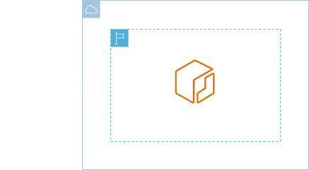
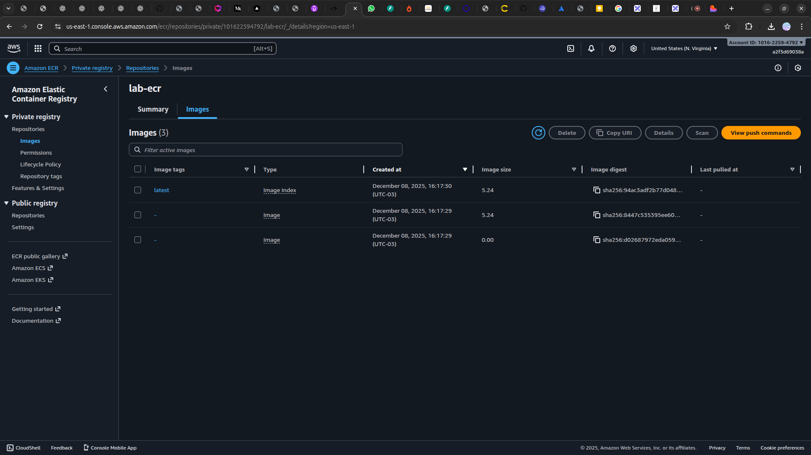

<h1 align=center> Amazon ECR - Subindo uma imagem Docker </h1>

    

<h2> Amazon Elastic Container Registry (ECR) </h2>

O Amazon Elastic Container Registry (ECR) é um serviço gerenciado pela AWS que permite armazenar, gerenciar e implantar imagens de contêineres de forma segura e escalável. Com o ECR, você pode criar repositórios privados para suas imagens de contêineres e controlar quem pode acessar esses repositórios usando permissões do IAM.

O ECR é integrado nativamente com outros serviços da AWS, como Amazon ECS (Elastic Container Service) e Amazon EKS (Elastic Kubernetes Service), simplificando o processo de implantação de aplicativos em contêineres na nuvem AWS. 

<h2> Conteúdo do laboratório </h2>

Neste laboratório você aprenderá a criar um arquivo Dockerfile, a fazer o build da imagem Docker, criar um repositório ECR e fazer o upload da imagem para o repositório do ECR.

<h2>Tarefas a serem executadas</h2>

1. Crie um Dockerfile.
2. Realize o build de uma imagem Linux Alpine e Apache utilizando o Docker.
3. Armazene sua imagem no ECR.

<h2>Resultado</h2>

    

