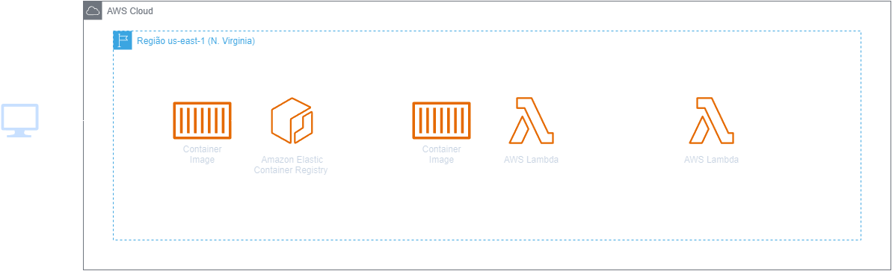
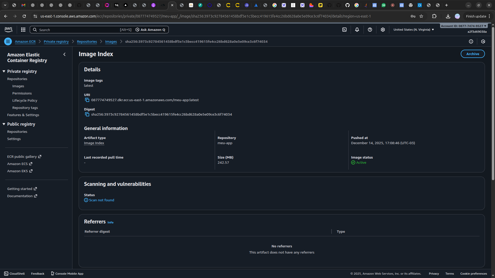
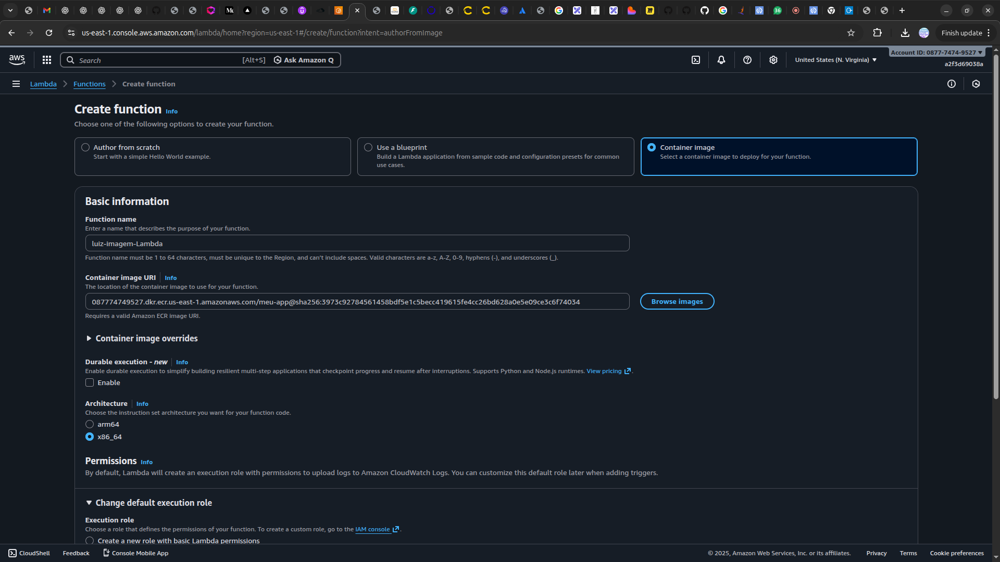
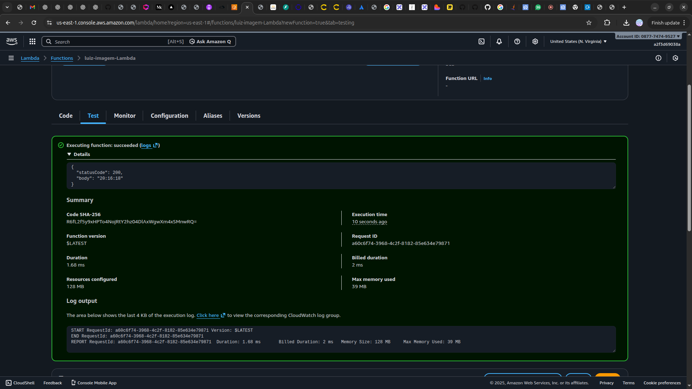

<h1 align=center> AWS Lambda - Criando e rodando uma imagem Docker no AWS Lambda </h1>

    

<h2> AWS Lambda </h2>

O AWS Lambda permite que você execute código sem provisionar ou gerenciar servidores. Você paga apenas pelo tempo de computação que utilizar. O Lambda se encarrega de toda infraestrutura necessária para executar e escalar com alta disponibilidade. Apartir de Dezembro de 2020, O AWS Lambda permite empacotar e implantar funções como imagens de contêiner. Os clientes podem aproveitar a flexibilidade e familiaridade das ferramentas de contêiner e a agilidade e simplicidade operacional do AWS Lambda para criar aplicações.

<h2> Conteúdo do laboratório </h2>

Neste laboratório você irá aprender a criar um Dockerfile de uma imagem Python de imagem base da AWS, subir em um repositório do ECR e criar uma Lambda utilizando o imagem de contêiner armazenada no ECR.

<h2>Tarefas a serem executadas</h2>

1 - Crie um diretório para o projeto
2- Configurar um Dockerfile
3- Criar uma função Python
4- Fazer o build da imagem Docker
5- Criar um repositório no Amazon ECR
6- Fazendo upload da imagem Docker para o Amazon ECR
7- Crie uma função Lambda a partir de uma imagem do ECR
8- Teste sua função Lambda

<h2>Resultado</h2>

    

    

    

