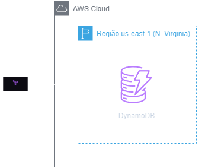
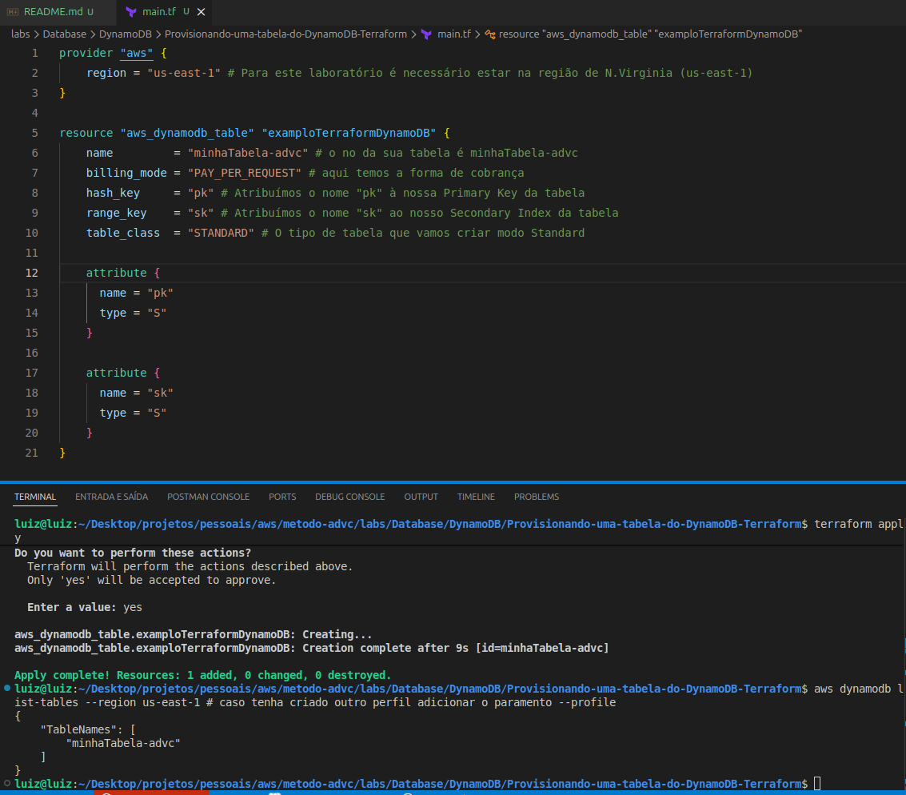

<h1 align=center> Terraform - Provisionando uma tabela do DynamoDB </h1>

    

<h2> Terraform </h2>

O Terraform é uma ferramenta de infraestrutura como código desenvolvida pela HashiCorp, que permite aos usuários definir e provisionar data centers utilizando uma linguagem de configuração declarativa. Com o Terraform, você pode criar, gerenciar e versionar recursos de infraestrutura de maneira eficiente e automatizada. Ele suporta múltiplos provedores de serviços de nuvem, como AWS, Azure e Google Cloud, facilitando a implementação de infraestruturas híbridas e multi-cloud

<h2> Amazon DynamoDB </h2>

O Amazon DynamoDB é um banco de dados de chave-valor NoSQL, sem servidor e totalmente gerenciado, projetado para executar aplicações de alta performance em qualquer escala. O DynamoDB oferece segurança integrada, backups contínuos, replicação multirregional automatizada, armazenamento em cache na memória e ferramentas de importação e exportação de dados. 

<h2> Conteúdo do laboratório </h2>

Neste laboratório, você aprenderá a realizar o provisionamento de instâncias EC2 na Amazon Web Services (AWS) e a instalar o Docker automaticamente por meio de um script de inicialização.

<h2>Tarefas a serem executadas</h2>

1 - Criar um Diretório para o Laboratório
2 - Configure suas credenciais do CLI
3- Crie um arquivo de configuração Terraform (.tf)
4 - Criar uma tabela do DynamoDB utilizando Terraform
5 - Destruir sua tabela do DynamoDB

<h2>Resultado</h2>

    

