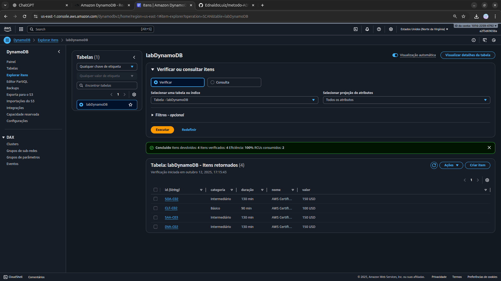
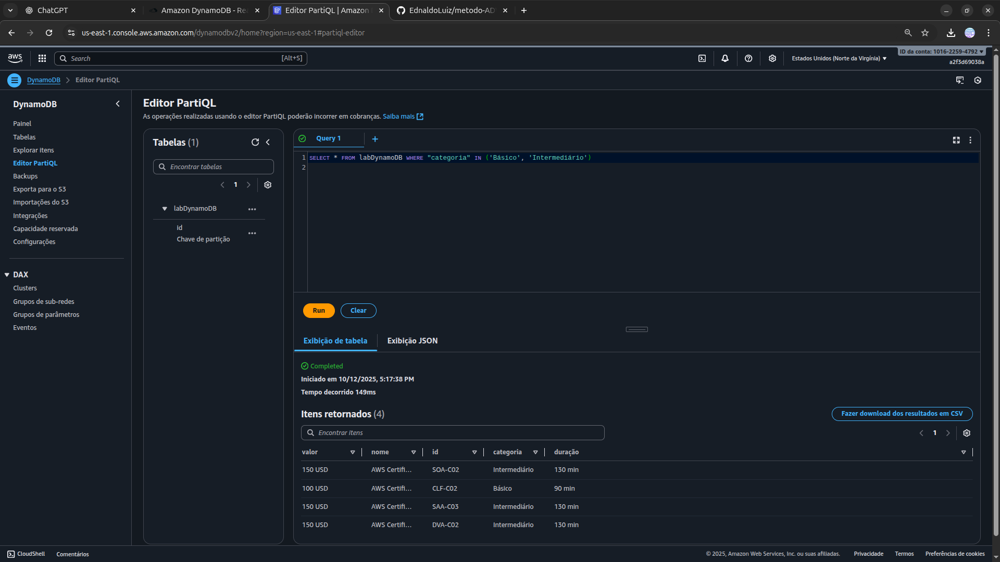

<h1 align=center> Amazon DynamoDB - Realizando sua primeira consulta com PartiQL </h1>

    

<h2> Amazon DynamoDB </h2>

O Amazon DynamoDB é um serviço de banco de dados NoSQL totalmente gerenciado, oferecido pela Amazon Web Services (AWS), que fornece desempenho rápido e previsível com escalabilidade perfeita. Projetado para lidar com grandes volumes de dados, ele permite armazenar e recuperar qualquer quantidade de informações, ao mesmo tempo que oferece latências de milissegundos.

Com características como replicação de dados em múltiplas regiões, suporte a transações ACID, integração com outros serviços AWS e uma estrutura de cobrança baseada em uso, o DynamoDB é ideal para aplicações que requerem alta disponibilidade e desempenho consistente, como aplicativos móveis, jogos, e-commerce e IoT.

<h2> PartiQL </h2>

PartiQL é uma linguagem de consulta para Amazon DynamoDB que oferece uma interface SQL simplificada e poderosa para acessar e manipular dados em tabelas NoSQL. Introduzida para facilitar a interação com DynamoDB, PartiQL permite executar operações de leitura e escrita com uma sintaxe familiar semelhante ao SQL tradicional, sem a necessidade de definir esquemas ou índices secundários explícitos.

Isso simplifica o desenvolvimento e a migração de aplicações que necessitam de consultas complexas, agregações e filtragem de dados, proporcionando maior flexibilidade e produtividade aos desenvolvedores ao lidar com grandes volumes de dados e cargas de trabalho variáveis no DynamoDB.

<h2> Conteúdo do laboratório </h2>

Neste laboratório iremos aprender a criar uma tabela no Amazon DynamoDB e a realizar uma consuta utilizando PartiQL.

<h2>Tarefas a serem executadas</h2>

1. Realize o login na console de gerenciamento da AWS.
2. Crie uma tabela no DynamoDB.
3. Adicione itens na tabela para consulta.
4. Realize consultas com PartiQL.

<h2>Resultado</h2>

    

    

