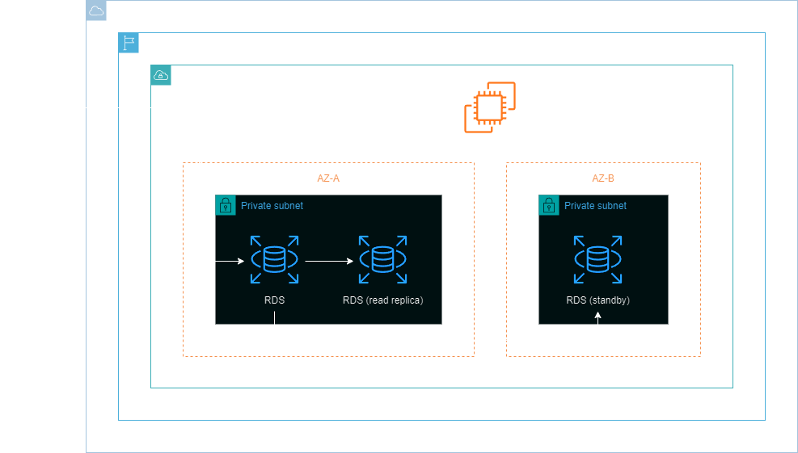
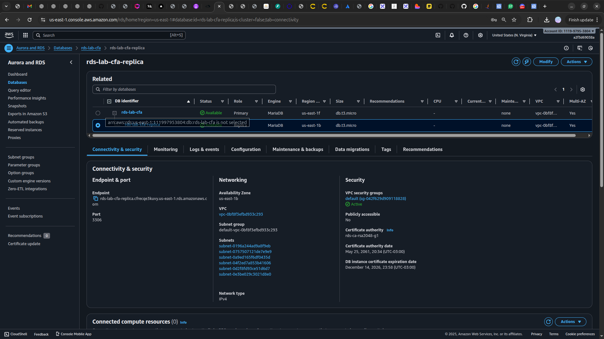

<h1 align=center> Amazon RDS - Criando um RDS em Alta Disponibilidade (Multi-AZ) e habilitando a Réplica de Leitura </h1>

    

<h2> Amazon RDS </h2>

O Amazon RDS é um serviço de banco de dados relacional gerenciado da AWS que simplifica a configuração e operação. Oferece uma variedade de mecanismos de banco de dados, incluindo MySQL, PostgreSQL, Oracle, SQL Server e MariaDB.

<h2> Multi-AZ </h2>

O recurso de multi-AZ do Amazon RDS cria uma cópia da sua instância de banco de dados em uma zona de disponibilidade diferente dentro da mesma região. Isso ajuda a garantir que o seu banco esteja sempre disponível, ou seja, mantendo a alta disponibilidade de seus dados.

<h2> Réplica de leitura </h2>

A réplica de leitura do Amazon RDS cria uma ou mais cópias, somente leitura, da sua instância de banco de dados dentro da mesma região da AWS. Isso pode ser usado para escalar a capacidade de leitura do seu banco de dados.

<h2> Conteúdo do laboratório </h2>

Como um Arquiteto de Valor Cloud é esperado que criemos aplicações resilientes altamente disponíveis e que seja capaz de escalar de acordo com o número de acessos. Neste laboratório iremos aprender como habilitar o recurso de multi-AZ do RDS bem como criar uma instância de réplica de leitura.

<h2>Tarefas a serem executadas</h2>

1. Acesse a console de gerenciamento da AWS.
2. Crie um security group para o RDS.
3. Crie um banco de dados MariaDB no RDS com o Multi-AZ habilitado.
4. Crie uma réplica de leitura do seu banco de dados.
5. Inicie uma instância do EC2.
6. Conecte-se ao banco de dados.
7. Insira dados a uma tabela do banco.
8. Faça a leitura de dados da réplica de leitura.

<h2>Resultado</h2>

    

    

    

