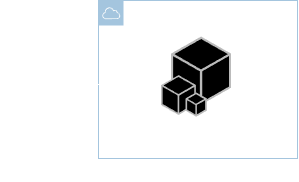
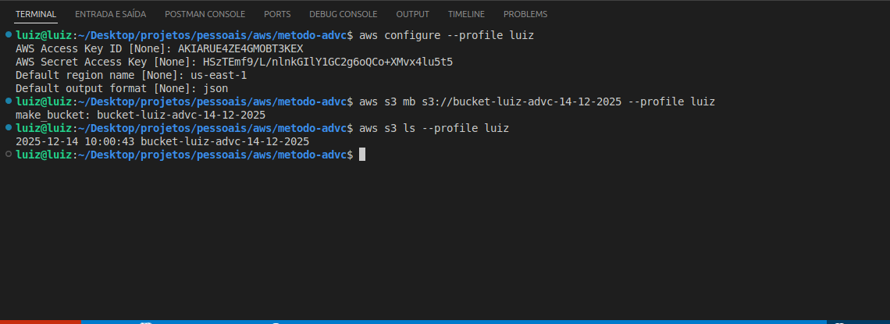

<h1 align=center> AWS CLI - Configurando perfis de acesso no AWS CLI </h1>

    

<h2> AWS Command Line Interface </h2>

A AWS Command Line Interface é uma ferramenta poderosa que permite aos usuários interagir e gerenciar serviços da AWS diretamente a partir da linha de comando. Essa interface oferece uma variedade de comandos que abrangem desde o provisionamento de recursos na nuvem até a configuração e monitoramento de serviços. Com a AWS CLI, os usuários podem automatizar tarefas, criar scripts e realizar operações complexas de maneira eficiente, proporcionando uma abordagem flexível e programática para a administração de recursos na nuvem AWS. Com apenas uma ferramenta, você poderá controlar vários produtos da AWS pela linha de comando e automatizá-los usando scripts.

<h2> Conteúdo do laboratório </h2>

Neste laboratório iremos aprender a configurar um perfil (profile) no AWS CLI, além de criar e listar buckets no Amazon S3.

<h2>Tarefas a serem executadas</h2>

1. Faça a instalação.
2. Verifique a instalação.
3. Faça a configuração do perfil (profile).
4. Teste o seu profile.
5. Verifique o êxito dos comandos.

<h2>Resultado</h2>

    

