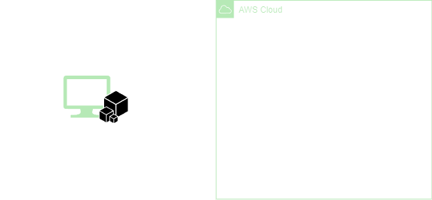
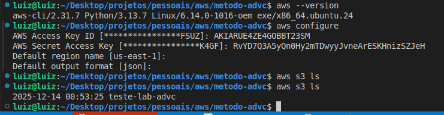

<h1 align=center>  AWS CLI - Conhecendo e configurando acesso via CLI </h1>

    

<h2> AWS Command Line Interface (AWS CLI) </h2>

A AWS Command Line Interface (AWS CLI) é uma ferramenta que permite interagir com serviços da Amazon Web Services, através da linha de comando.

<h2> Conteúdo do laboratório </h2>

Neste laboratório, você terá a oportunidade de familiarizar-se e configurar o AWS Command Line Interface (CLI) da AWS.

<h2>Tarefas a serem executadas</h2>

1. Criação de um bucket S3.
1. Instalação da AWS CLI.
2. Configuração inicial.
3. Verificação.

<h2>Resultado</h2>

    

