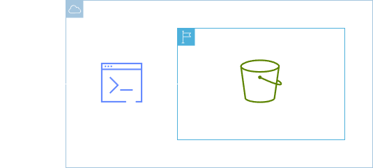

<h1 align=center> AWS CLI - Enviando arquivos para o Amazon S3 </h1>

    

<h2> AWS CLI </h2>

É uma ferramenta unificada para o gerenciamento de seus produtos da AWS. Com apenas uma ferramenta para baixar e configurar, você poderá controlar vários produtos da AWS pela linha de comando e automatizá-los usando scripts.

<h2> Conteúdo do laboratório </h2>

Neste laboratório iremos aprender a como instalar e configurar o AWS CLI, utilizando o mesmo para criarmos um bucket no Amazon S3, fazendo upload de arquivos para o bucket criado.

<h2>Tarefas a serem executadas</h2>

1. Instalando o AWS CLI.
2. Faça a configuração inicial.
3. Faça a verificação.
4. Crie um bucket S3 e faça o upload de um arquivo.
5. Comandos opcionais.

<h2>Resultado</h2>

    

