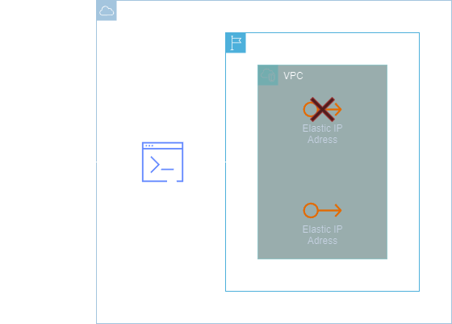
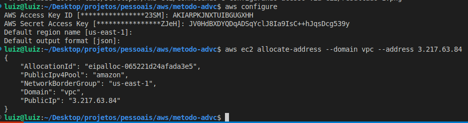

<h1 align=center> AWS CLI - Recuperando um EIP excluído acidentalmente </h1>

    

<h2> Elastic IP (IP elásticos) </h2>

Um Endereço IP Elástico é um endereço IPv4 estático projetado para computação em nuvem dinâmica. Ele é alocado para a conta da AWS e permanecerá associado a ela, até que seja explicitamente liberado. O Elastic IP (EIP) é um endereço IP estático que pode ser facilmente associado e dissociado de instâncias ou recursos na nuvem da Amazon Web Services (AWS). Ao contrário dos endereços IP convencionais, os EIPs oferecem flexibilidade na gestão de recursos, permitindo uma comunicação estável e confiável com instâncias EC2. 

<h2> Conteúdo do laboratório </h2>

Neste laboratório você irá aprender a recuperar um EIP em caso de exclusão acidental.

<h2>Tarefas a serem executadas</h2>

1. Acesse a console de gerenciamento da AWS.
2. Crie um Elastic IP.
3. Libere o IP de volta para a AWS.
4. Recupere o endereço IP Elástico via AWS CLI.

<h2>Resultado</h2>

    

