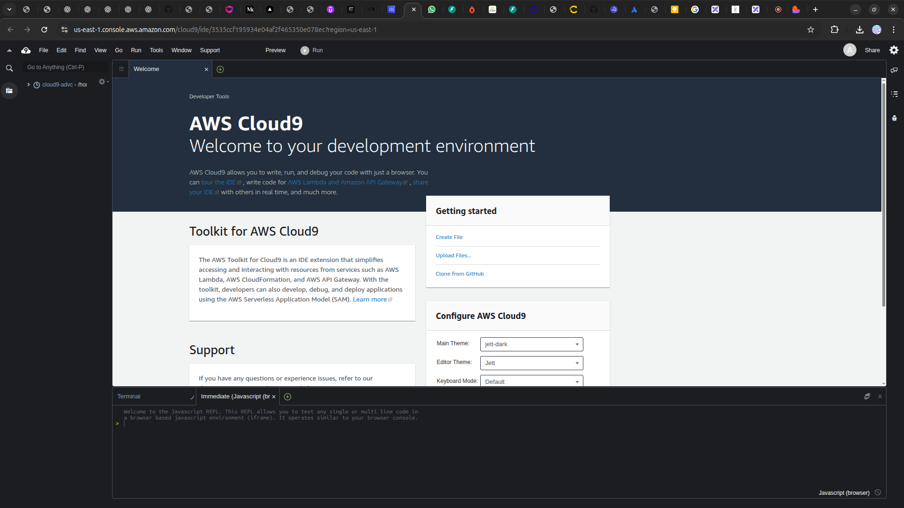

<h1 align=center> AWS Cloud9 - Provisionando e acessando um ambiente de desenvolvimento </h1>

    

<h2> AWS Cloud9 </h2>

O AWS Cloud9 é um ambiente integrado de desenvolvimento (IDE) baseado em nuvem que permite aos desenvolvedores escrever, executar e depurar código usando apenas um navegador. Totalmente gerenciado pela AWS, o Cloud9 oferece suporte a uma ampla gama de linguagens de programação, incluindo JavaScript, Python, PHP e muitos mais.

Com recursos como edição colaborativa em tempo real, integração com Git, terminais de linha de comando e ambientes de desenvolvimento pré-configurados, o AWS Cloud9 simplifica o processo de desenvolvimento, elimina a necessidade de configuração local e permite que os desenvolvedores colaborem de maneira eficiente e segura, independentemente de sua localização.

<h2> Conteúdo do laboratório </h2>

Neste laboratório você irá aprender a subir um ambiente de desenvolvimento no Cloud9.

<h2>Tarefas a serem executadas</h2>

1. Faça login na console de gerenciamento AWS.
2. Acesse o serviço AWS Cloud9.
3. Crie um ambiente de desenvolvimento.

<h2>Resultado</h2>

    

