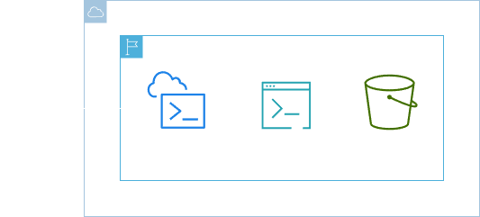

<h1 align=center> AWS CloudShell - Primeiros passos com a shell da AWS </h1>

    

<h2> AWS CloudShell </h2>

O AWS CloudShell é uma ferramenta de gerenciamento de linha de comando, baseada em navegador que permite aos usuários executarem comandos do AWS CLI, diretamente no console da AWS sem a necessidade de configuração local. Fornecendo um ambiente pré-configurado com as credenciais da sua conta, o CloudShell facilita o gerenciamento e a automação de recursos da AWS de maneira eficiente e segura. Além disso, ele suporta ferramentas populares e scripts, permitindo a personalização do ambiente de acordo com as necessidades do usuário.

<h2> Conteúdo do laboratório </h2>

Neste laboratório, você aprenderá a acessar e interagir com o AWS CloudShell.

<h2>Tarefas a serem executadas</h2>

1. Faça login na console de gerenciamento AWS.
2. Acesse o AWS CloudShell. 
3. Teste o AWS CloudShell usando o comando do AWS CLI.

<h2>Resultado</h2>

    

