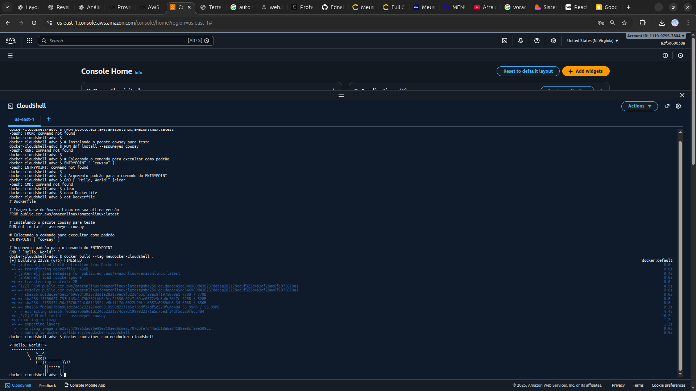

<h1 align=center>  AWS CloudShell - Testando nova funcionalidade de Docker no CloudShell </h1>

<h2> AWS CloudShell </h2>

O AWS CloudShell é um shell pré-autenticado baseado em navegador que você pode iniciar diretamente do AWS Management Console. Você pode navegar CloudShell de AWS Management Console algumas maneiras diferentes.

<h2> Conteúdo do laboratório </h2>

Neste laboratório, você aprenderá a rodar containers Docker dentro do terminal do do AWS CloudShell.

<h2>Tarefas a serem executadas</h2>

1 - Faça login na AWS
2 - Acesso o serviço do AWS CloudShell
3 - Preparando o ambiente e rodando o Docker

<h2>Resultado</h2>

    

