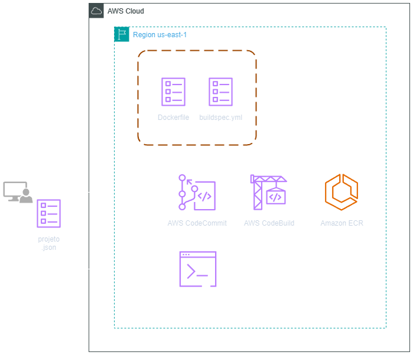
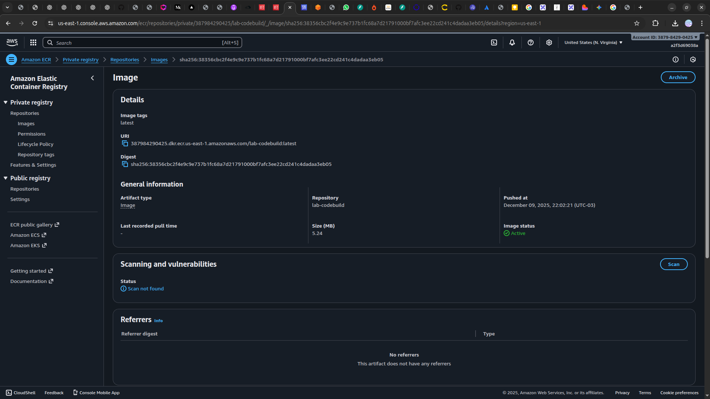
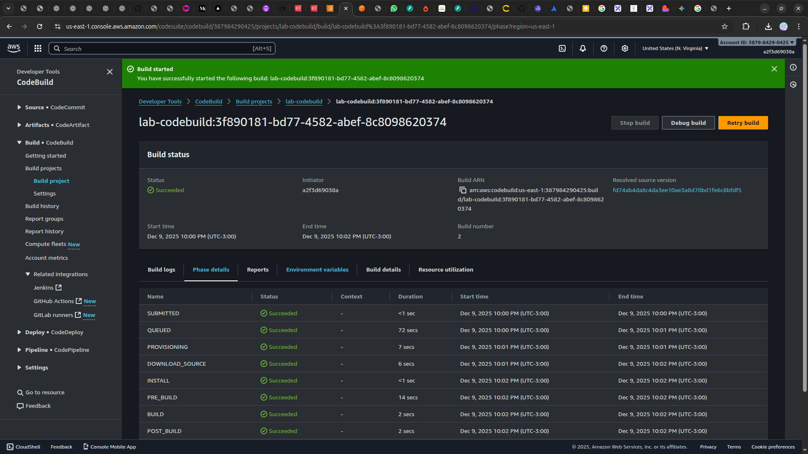

<h1 align=center>  AWS CodeBuild - Como fazer build de aplicações com o AWS CodeBuild </h1>

    

<h2> AWS CodeBuild </h2>

O AWS CodeBuild é um serviço de compilação totalmente gerenciado que automatiza o processo de compilação, teste e empacotamento de código-fonte em aplicações executáveis. Projetado para funcionar perfeitamente com outras ferramentas e serviços da AWS, o CodeBuild permite que os desenvolvedores compiIem e testem suas aplicações de forma rápida e confiável, garantindo a entrega contínua de software de alta qualidade. Com suporte para diversas linguagens de programação, ambientes de execução customizáveis e integração nativa com repositórios de código como o AWS CodeCommit, GitHub e Bitbucket, o CodeBuild oferece flexibilidade e escalabilidade para atender às necessidades variadas de desenvolvimento. Além disso, sua integração fácil com o AWS CodePipeline facilita a criação de pipelines de entrega contínua, proporcionando uma abordagem simplificada e eficiente para o desenvolvimento ágil de software.

<h2> Conteúdo do laboratório </h2>

Neste laboratório iremos aprender a criar um repositório do CodeCommit, um repositório de imagens de container no ECR e realizar o build de um arquivo Dockerfile e armazenar essa imagem no ECR utilizando CodeBuild.

<h2>Tarefas a serem executadas</h2>

1. Realizar o login na conta AWS 
2. Configuração de suas credenciais CLI
3. Criar Política
4. Criar Função (Role)
5. Crie uma Credenciais HTTPS do Git para o AWS CodeCommit
6. Criar um repositório no Amazon ECR
7. Criar um repositório do AWS CodeCommit
8. Crie um diretório para o projeto
9. Criado um arquivo .json para criar um projeto de compilação
10. Criar um Dockerfile
11. Criado um arquivo buildspec
12. Crie um projeto de compilação do CodeBuild
13. Executar uma compilação (build) no CodeBuild utilizando a AWS CLI
14. Verifique que projeto de compilação foi criado e excutado através do console AWS

<h2>Resultado</h2>

    

    

