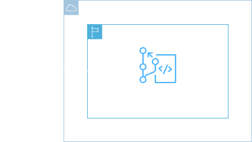
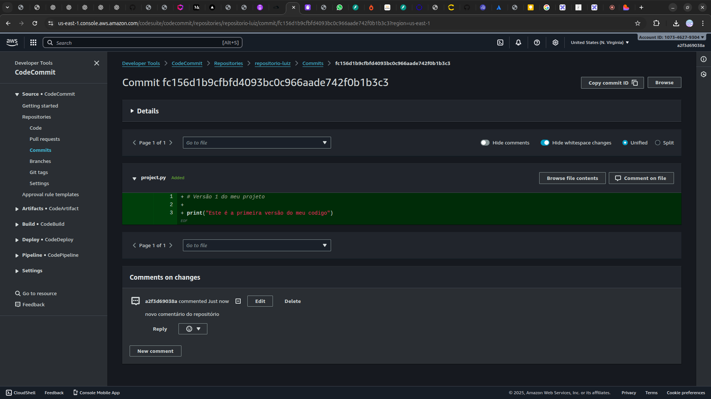

<h1 align=center> AWS CodeCommit - Criando meu primeiro repositório </h1>

    

<h2> AWS CodeCommit </h2>

O AWS CodeCommit é um serviço de controle de versão totalmente gerenciado que hospeda repositórios Git seguros na nuvem. Ele facilita a colaboração no desenvolvimento de software, permitindo que equipes armazenem e versionem seu código com alta disponibilidade e segurança. O CodeCommit integra-se perfeitamente com outros serviços da AWS e ferramentas de desenvolvimento populares, oferecendo suporte para fluxos de trabalho de CI/CD.

Com recursos como notificações automáticas, controles de acesso granulares e criptografia de dados em trânsito e em repouso, o AWS CodeCommit ajuda a garantir que o código esteja seguro e acessível, simplificando a gestão do ciclo de vida do software e promovendo a produtividade das equipes de desenvolvimento.

<h2> Conteúdo do laboratório </h2>

O Objetivo deste laboratório é criar seu primeiro repositório usando o AWS Code Commit, acessá-lo através da console, realizarmos upload de um arquivo, editá-lo e verificarmos como funciona o armazenamento e versionamento de código de forma segura e escalável.

<h2>Tarefas a serem executadas</h2>

1. Acesse a console de gerenciamento AWS.
2. Crie um repositório no AWS CodeCommit.
3. Edite o arquivo após o upload.
4. Verifique o histórico das alterações.

<h2>Resultado</h2>

    

