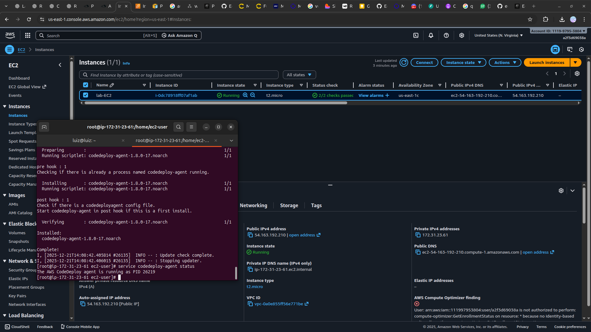
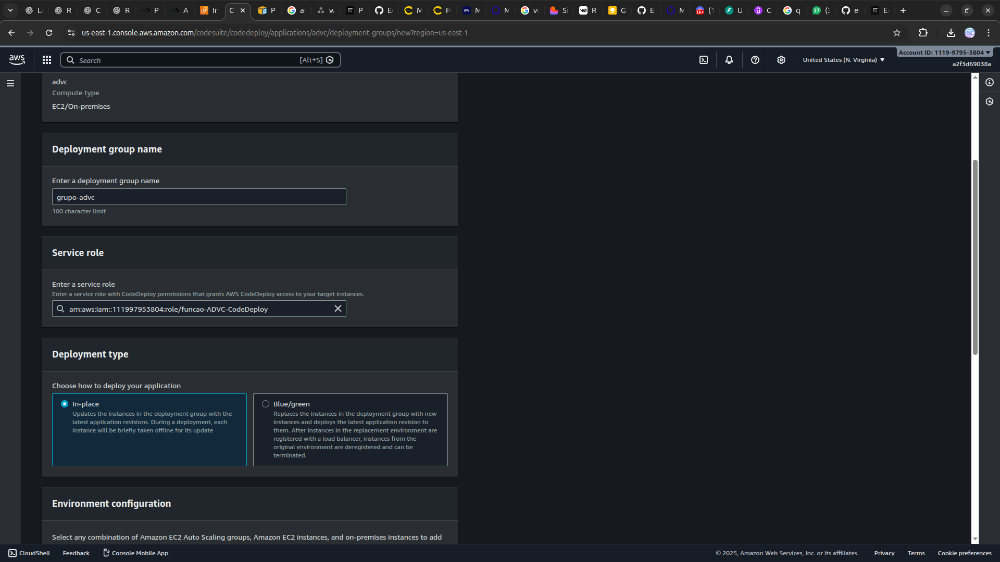

<h1 align=center> AWS CodePipeline - Minha primeira pipeline utilizando AWS CodeDeploy </h1>

    

<h2> AWS CodeDeploy </h2>

O AWS CodeDeploy é um serviço de implantação que automatiza a implantação de aplicativos em instâncias Amazon EC2, instâncias locais, funções Lambda sem servidor ou serviços Amazon ECS. Ele permite implantar uma variedade quase ilimitada de conteúdo de aplicativos, incluindo código, funções AWS Lambda sem servidor, arquivos da web e de configuração, executáveis, pacotes, scripts e arquivos multimídia. O CodeDeploy pode implantar conteúdo de aplicativos que são executados em um servidor e são armazenados em buckets do Amazon S3, repositórios do GitHub ou repositórios do Bitbucket.

<h2> AWS CodePipeline </h2>

O AWS CodePipeline é um serviço de entrega contínua que ajuda a automatizar o processo de lançamento de software. Ele permite modelar, visualizar e automatizar as etapas necessárias para liberar seu software. O CodePipeline pode ser usado para uma variedade de aplicativos, incluindo aplicativos executados em instâncias Amazon EC2, funções AWS Lambda sem servidor, serviços Amazon ECS e instâncias locais. Ele pode implantar conteúdo de aplicativos que são armazenados em buckets do Amazon S3, repositórios do GitHub ou repositórios do Bitbucket.

O CodePipeline funciona com vários sistemas de gerenciamento de configuração, controle de origem, integração contínua, entrega contínua e implantação contínua. Ele também pode ser usado para atualizar as versões das funções AWS Lambda, lançar rapidamente novos recursos, evitar tempo de inatividade durante a implantação do aplicativo e lidar com a complexidade de atualizar seus aplicativos, sem muitos dos riscos associados a implantações manuais propensas a erros.

<h2> Conteúdo do laboratório </h2>

Neste laboratório, você utilizará AWS CodeDeploy e AWS CodePipeline. Será criado um pipeline que integrará o S3, o CodeDeploy e o CodePipeline, permitindo o envio de alterações diretamente para a instância do EC2.

<h2>Tarefas a serem executadas</h2>

1. Acesse a console de gerenciamento AWS.
2. Acesse o AWS IAM e crie uma função para o EC2.
3. Crie uma função para o CodeDeploy.
4. Crie uma Instância EC2.
5. Acesse a instância via terminal SSH no Linux.
6. Acesse a instância via PuTTY.
7. Instale o agente CodeDeploy.
8. Crie um bucket no Amazon S3.
9. Crie um aplicativo CodeDeploy e um grupo de implantação.
10. Crie um pipeline do CodePipeline e implante o aplicativo na instância.
11. Teste o aplicativo usando o DNS IPv4 público da instância EC2.

<h2>Resultado</h2>

    

    

