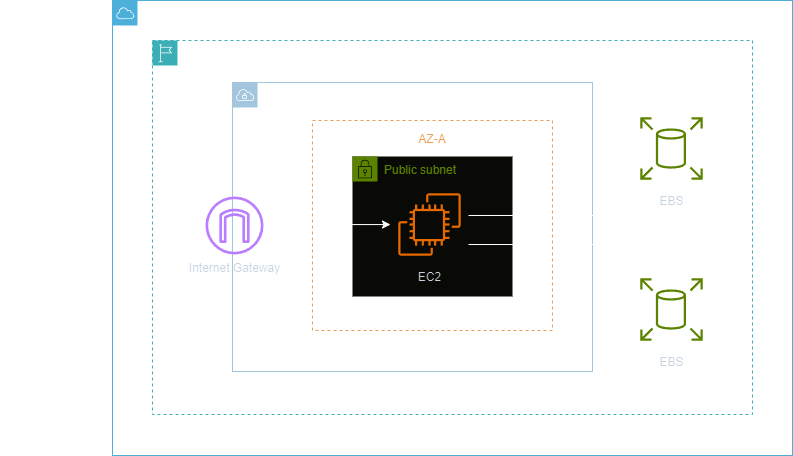
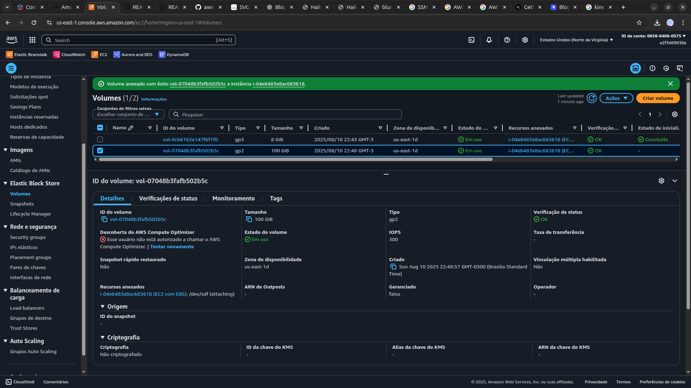
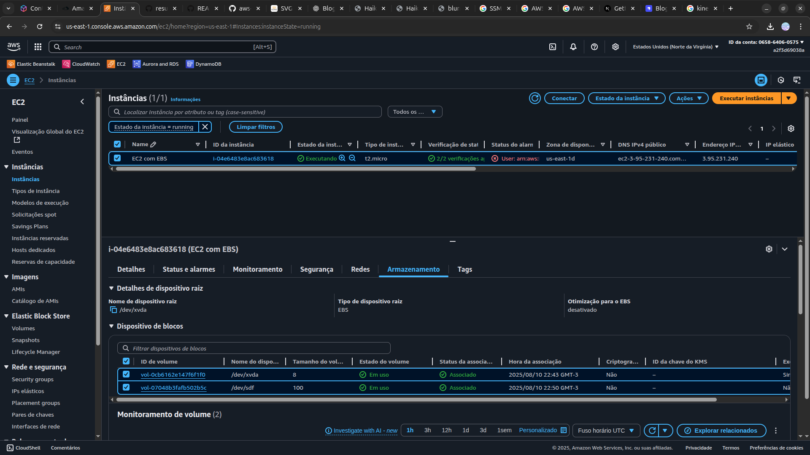

<h1 align=center> Amazon EC2 - Adicionando EBS extra a uma EC2 </h1>

    

<h2> Conteúdo do laboratório </h2>

Neste laboratório, você aprenderá a criar um volume EBS e associá-lo a uma instância EC2.

<h2>Tarefas a serem executadas</h2>

1. Acesse o console de gerenciamento da AWS.
2. Crie uma instância EC2.
3. Navegue até "volumes" e crie um volume EBS.
4. Verifique o status do volume.
5. Anexe o volume a uma instância EC2.

<h2>Resultado</h2>

    

    

