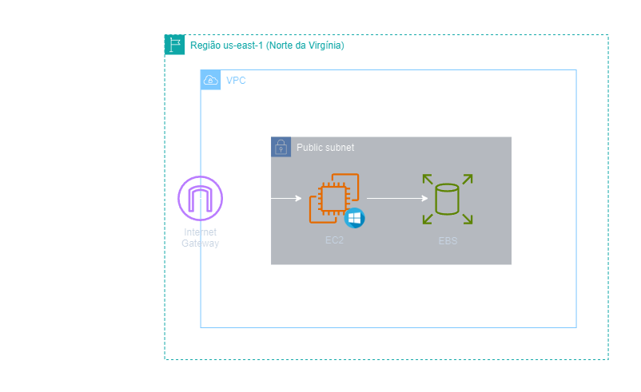

<h1 align=center> Amazon EBS - Adicionando um novo volume EBS na Amazon EC2 - Windows</h1>

<h2>Arquitetura do laboratório</h2>

    

---

<h2>Tarefas a serem executadas</h2>

1. Criação e configuração de instância EC2.
2. Criação de volume EBS.
3. Associação do volume à instância.
4. Conexão à instância Windows.
5. Gerenciamento do volume anexado.

<h2>Resultado</h2>

