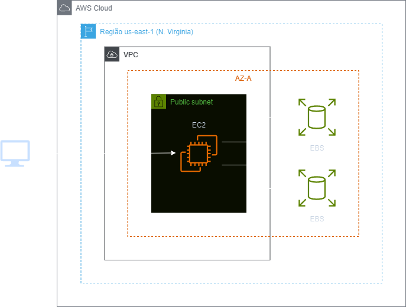
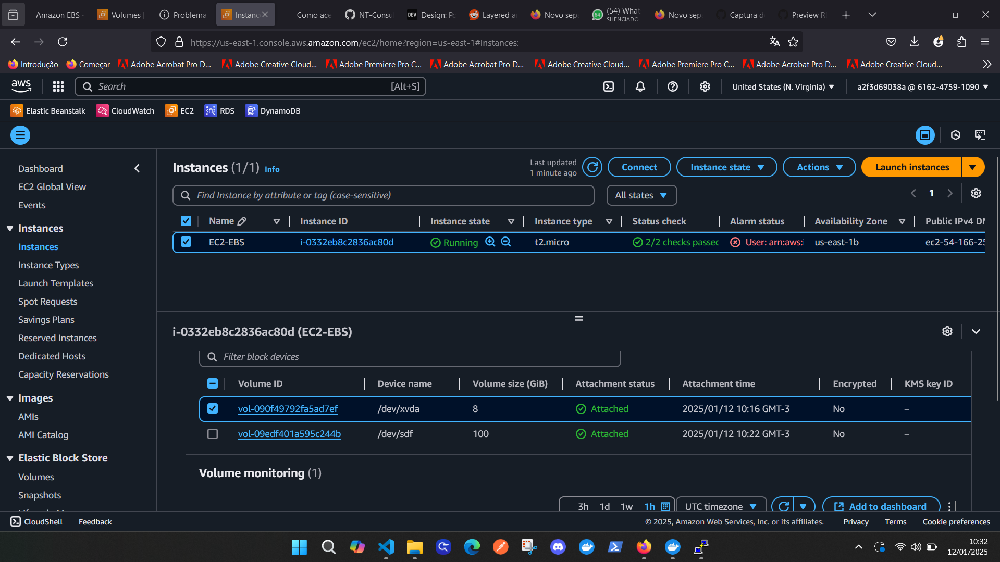
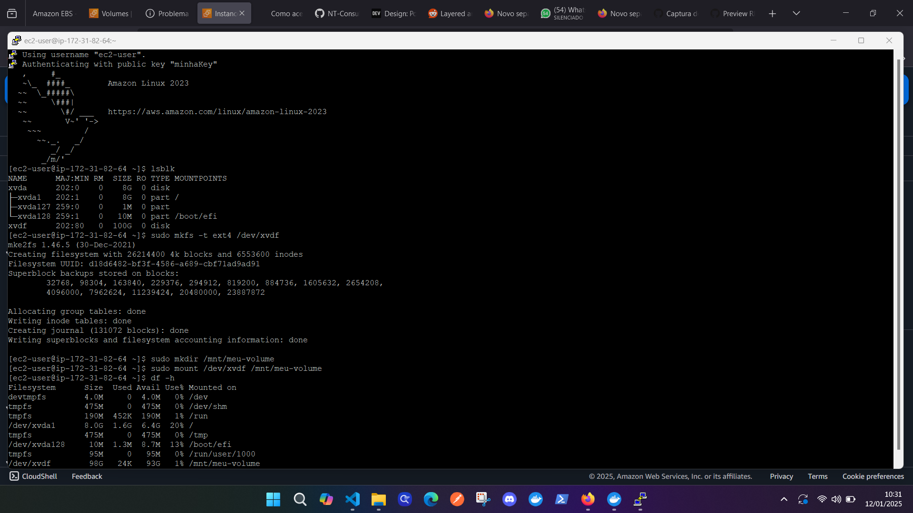

<h1 align=center> Amazon EBS - Adicionando um novo volume EBS na Amazon EC2 - Linux</h1>

<h2>Arquitetura do laboratório</h2>

    

---

<h2>Amazon Elastic Block Store (EBS)</h2>

O Amazon Elastic Block Store (EBS) é um serviço de armazenamento de blocos da AWS que oferece volumes de armazenamento persistente para uso com instâncias do Amazon EC2. Ele fornece uma maneira confiável e escalável de armazenar dados que persistem independentemente da vida útil da instância EC2. Os volumes EBS são altamente disponíveis e duráveis, replicados automaticamente dentro de uma zona de disponibilidade para proteção contra falhas de hardware.

Eles podem ser facilmente anexados a instâncias EC2, permitindo que você armazene e acesse dados de forma eficiente para uma ampla variedade de cargas de trabalho. Com recursos como snapshots para backup e restauração, provisionamento de IOPS para desempenho otimizado e a capacidade de redimensionar volumes conforme necessário, o Amazon EBS é uma peça fundamental na construção de arquiteturas de armazenamento confiáveis e escaláveis na nuvem da AWS.

---

<h2> Conteúdo do laboratório </h2>

Neste laboratório, você aprenderá a adicionar e montar um volume EBS em uma instância Linux.

<h2>Tarefas a serem executadas</h2>

1. Acesso ao console da AWS.
2. Crie uma instância EC2.
3. Crie um novo volume EBS.
4. Atache o volume a uma instância EC2.
5. Monte o Volume EBS.

<h2>Resultado</h2>

    

    

