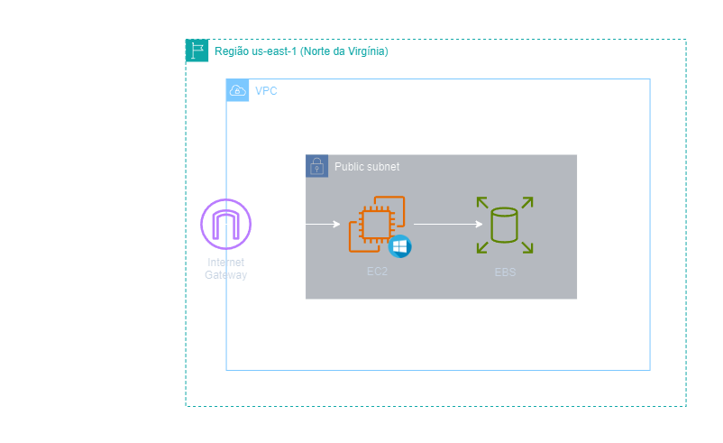
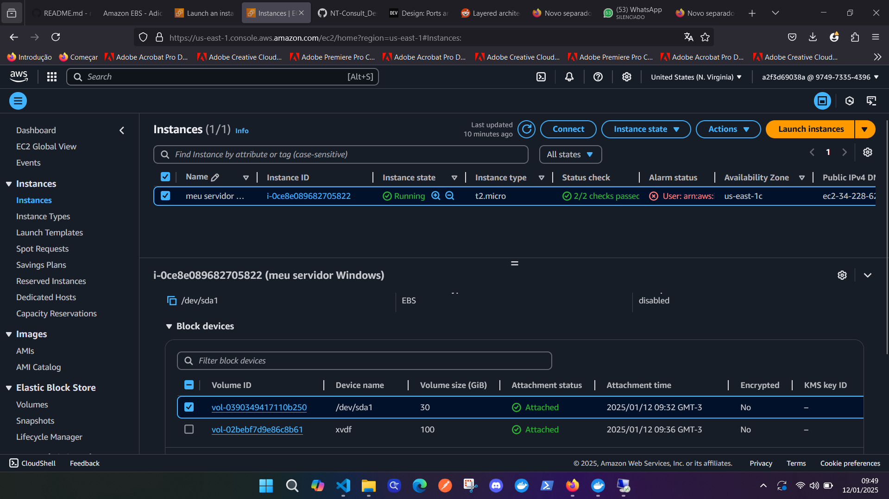
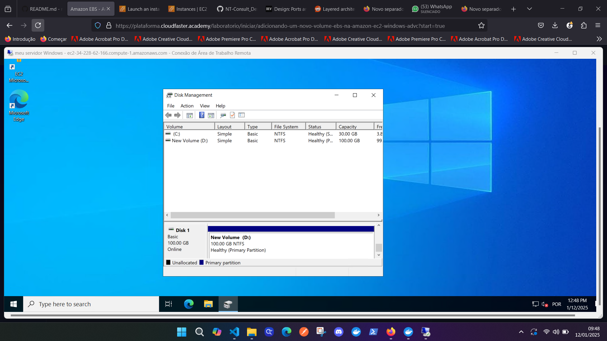

<h1 align=center> Amazon EBS - Adicionando um novo volume EBS na Amazon EC2 - Windows</h1>

<h2>Arquitetura do laboratório</h2>

    

---

<h2>Windows Server na AWS</h2>

A AWS oferece suporte a tudo que você precisa para construir e executar aplicações do Windows, incluindo Active Directory, .NET, Microsoft SQL Server, desktop como serviço do Windows e todas as versões compatíveis do Windows Server. Além disso, o suporte a licenças Windows na EC2 AWS proporciona benefícios significativos aos usuários, oferecendo flexibilidade de licenciamento com opções BYOL ou licenças inclusas, permitindo uma implementação rápida e escalabilidade para ambientes Windows.

**BYOL** (traga sua própria licença) com sua própria mídia licenciada de instâncias do EC2 para workloads do Windows Server e do SQL Server.

---

<h2> Conteúdo do laboratório </h2>

Neste laboratório, você aprenderá a adicionar e montar um volume EBS em uma instância Windows.

<h2>Tarefas a serem executadas</h2>

1. Criação e configuração de instância EC2.
2. Criação de volume EBS.
3. Associação do volume à instância.
4. Conexão à instância Windows.
5. Gerenciamento do volume anexado.

<h2>Resultado</h2>

    

    

