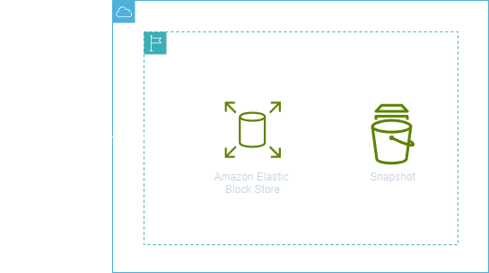
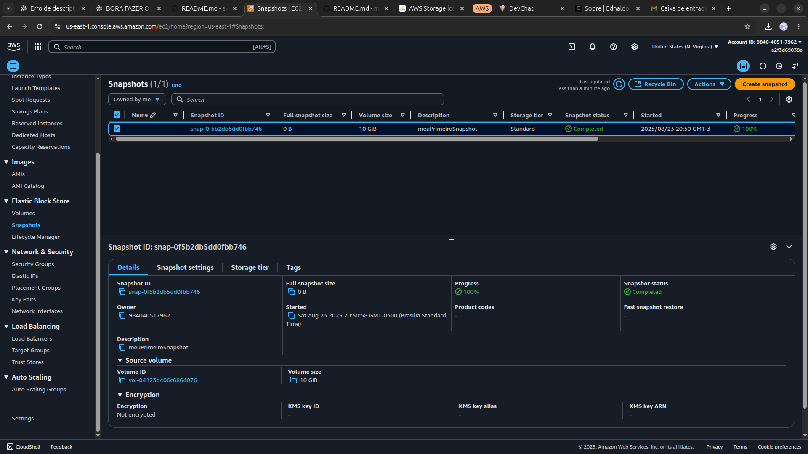

<h1 align=center> Amazon EBS - Criando snapshots de EBS </h1>

    

<h2> Snapshots do Amazon Elastic Block Store (EBS) </h2>

Os snapshots do Amazon Elastic Block Store (EBS) são cópias pontuais dos dados em volumes do Amazon EBS. Eles são armazenados no Amazon S3 de forma incremental, o que significa que apenas os blocos no dispositivo que mudaram desde o último snapshot são salvos. Os snapshots são essenciais para fazer backup e proteger os dados, e podem ser usados para criar volumes replicados. A definição de preço são baseadas na quantidade de dados armazenados e a exclusão de snapshots que não são mais necessários podem reduzir os custos de armazenamento.

<h2> Conteúdo do laboratório </h2>

Neste laboratório, você irá aprender a criar um snapshot de um volume EBS.

<h2>Tarefas a serem executadas</h2>

1. Acesse o Console de Gerenciamento da AWS.
2. Acesse o Amazon EC2.
3. Crie um volume EBS.
4. Verifique o status do volume.
5. Crie um snapshot de um volume EBS.
6. Verifique o status do seu snapshot.

<h2>Resultado</h2>

    

