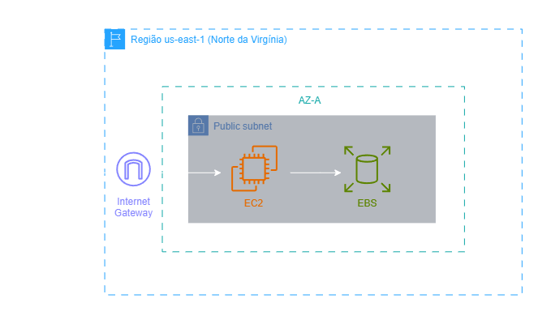
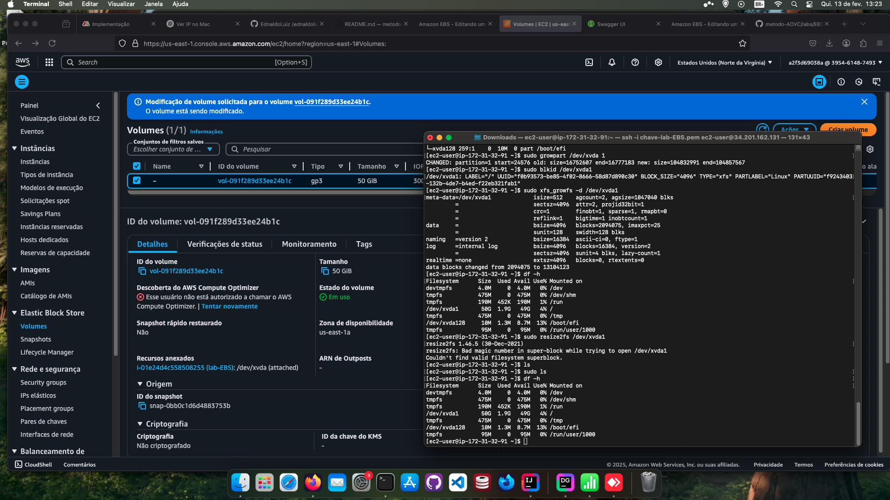

<h1 align=center> Amazon EBS - Editando um volume EBS já existente </h1>

    

<h2> Conteúdo do laboratório </h2>

Neste laboratório, você aprenderá a editar o tamanho do volume EBS.

<h2>Tarefas a serem executadas</h2>

1. Acessar a Console de Gerenciamento.
2. Criar uma instância EC2.
3. Edite o Volume EBS da instância EC2.
4. Configurar o Volume.
5. Verificar o espaço do Volume.

<h2>Resultado</h2>

    

