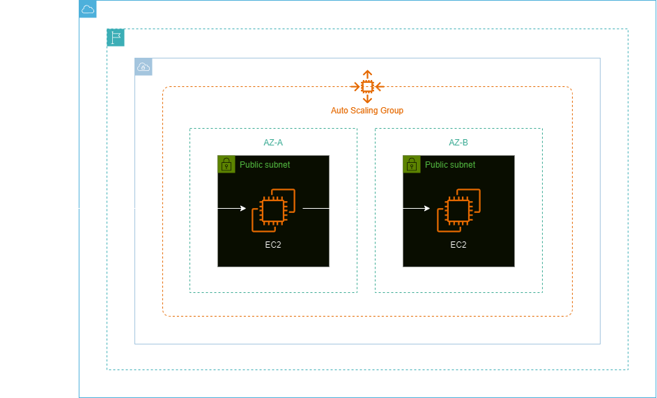
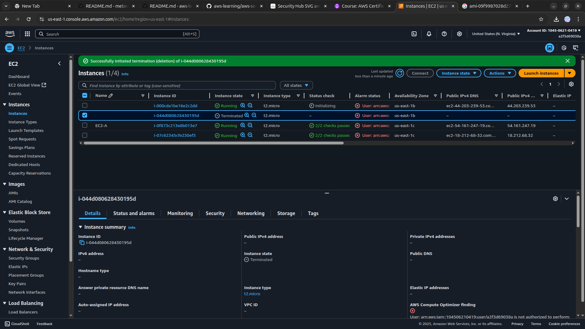

<h1 align=center> Amazon EC2 Auto Scaling - Criando um template do EC2 Auto Scaling </h1>

    

<h2> Amazon EC2 Auto Scaling </h2>

O Amazon EC2 Auto Scaling é um serviço da AWS que ajusta automaticamente o número de instâncias do Amazon EC2 conforme a demanda, garantindo que você tenha capacidade suficiente para lidar com variações de tráfego. Ele funciona iniciando instâncias adicionais quando a demanda aumenta e desligando instâncias extras quando a demanda diminui, ajudando a manter a disponibilidade da aplicação e otimizar os custos.

<h2> Conteúdo do laboratório </h2>

Neste laboratório você ira aprender subir uma instância EC2, criar uma AMI e criar um modelo de execução para Auto Scaling Group(ASG).

<h2>Tarefas a serem executadas</h2>

1. Realize o login na console de gerenciamento AWS.
2. Crie instâncias EC2.
3. Crie um Modelo de Execução para o Auto Scaling Group (ASG).
4. Crie um Launch Template.
5. Crie um Auto Scaling Group (ASG).
6. Teste o seu Auto Scaling Group (ASG).

<h2>Resultado</h2>

    

