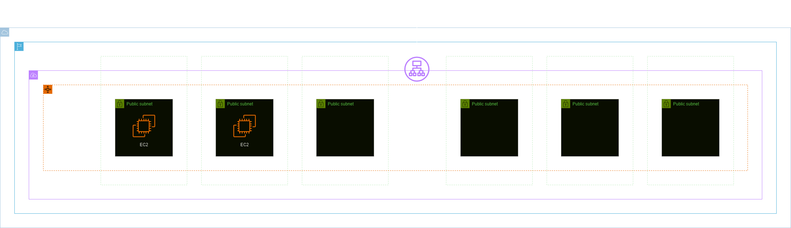
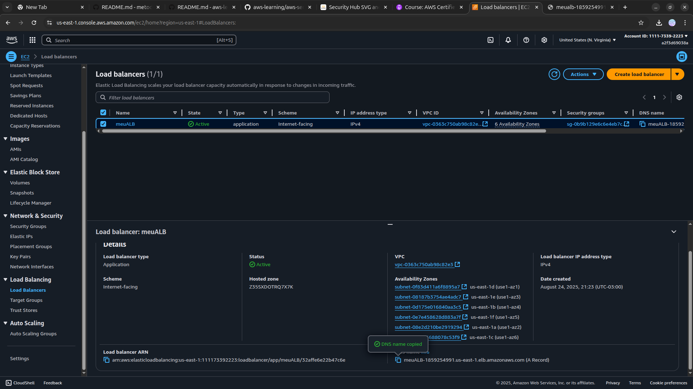
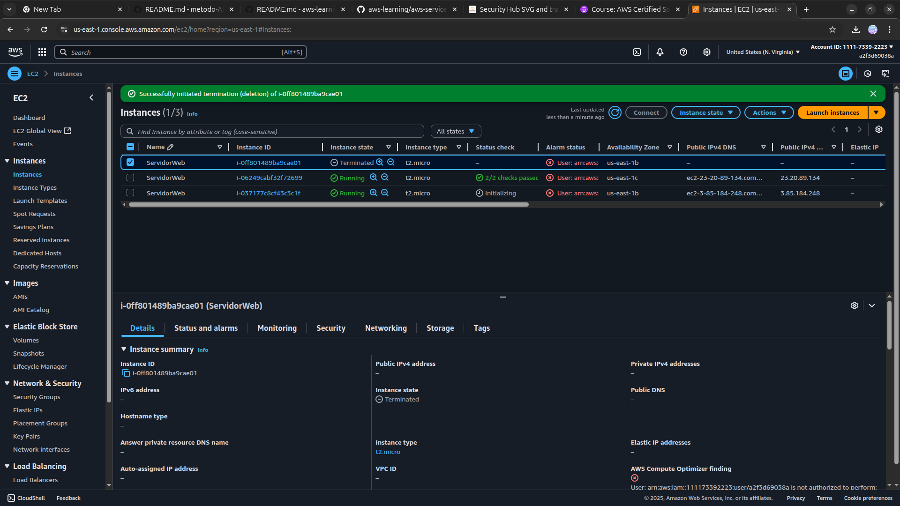

<h1 align=center> Amazon EC2 Auto Scaling - Implementando e acompanhando o lançamento de Instâncias EC2 </h1>

    

<h2> Grupos do Auto Scaling </h2>

Os grupos do Auto Scaling da AWS são uma ferramenta fundamental para otimizar a escalabilidade e a resiliência em ambientes de nuvem. Este recurso permite a automação da adição ou remoção de instâncias EC2 conforme a demanda da aplicação, ao configurar políticas baseadas em métricas específicas, como CPU ou utilização de recursos, o Auto Scaling garante que o número de instâncias esteja sempre alinhado com as necessidades do sistema. Além disso, o Auto Scaling pode ser integrado a um balanceador de carga, o Elastic Load Balancer (ELB), para distribuir o tráfego de maneira uniforme e manter a alta disponibilidade da aplicação.

<h2> Conteúdo do laboratório </h2>

Neste laboratório, iremos aprender a criar de um modelo de execução utilizando uma AMI fornecida pela AWS. Através de um script personalizado para a instalação do Apache, iremos integrar a AMI a um Grupo de Auto Scaling, estabelecendo uma infraestrutura escalável e resiliente. Além disso, será configurado um Application Load Balancer (ALB), permitindo uma distribuição eficiente do tráfego entre as instâncias e proporcionando alta disponibilidade.

<h2>Tarefas a serem executadas</h2>

1. Faça login na console de gerenciamento da AWS.
2. Crie um modelo de execução.
3. Crie um grupo de destino.
4. Crie um Application Load Balancer.
5. Crie um grupo Auto Scaling.
6. Teste o grupo Auto Scaling criado.

<h2>Resultado</h2>

    

    

