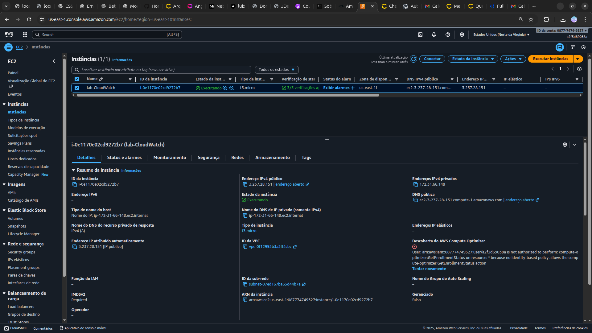

<h1 align=center>  Amazon CloudWatch - Monitorando uma instância Amazon EC2 </h1>

    

<h2> Amazon CloudWatch </h2>

O Amazon CloudWatch é um serviço abrangente de monitoramento e observabilidade oferecido pela Amazon Web Services (AWS). Projetado para fornecer insights precisos e em tempo real sobre os recursos da sua infraestrutura na nuvem, o CloudWatch permite que você colete e monitore métricas importantes, registre logs detalhados e configure alarmes proativos para responder rapidamente a eventos significativos.

Com uma interface intuitiva e flexível, o CloudWatch oferece visualizações personalizáveis, dashboards interativos e recursos avançados de análise de dados para otimizar o desempenho e garantir a confiabilidade dos seus aplicativos e serviços na nuvem AWS. Além disso, sua integração com outras ferramentas da AWS permite uma gestão eficiente e centralizada, permitindo que você tenha um controle abrangente sobre sua infraestrutura e tome decisões informadas para garantir uma operação contínua e eficaz.

<h2> Conteúdo do laboratório </h2>

Neste laboratório, iremos aprender como criar uma instância do EC2 e um painel do CloudWatch para visualizar suas métricas de utilização de CP

<h2>Tarefas a serem executadas</h2>

1. Faça login na console de gerenciamento da AWS.
2. Crie uma instância EC2.
3. Crie um painel no CloudWatch.

<h2>Resultado</h2>

    

    

