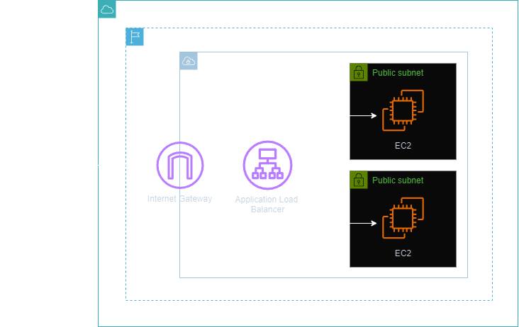
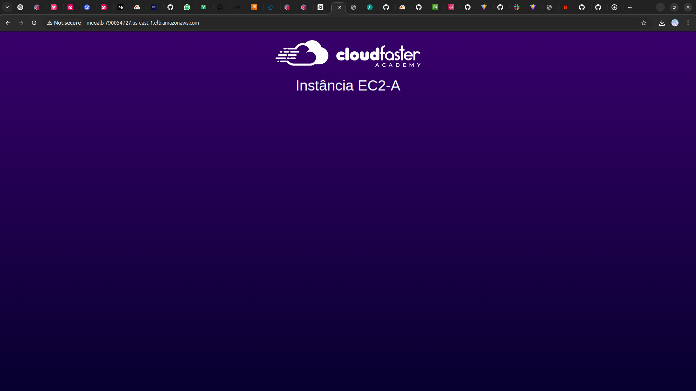

<h1 align=center> Amazon EC2 - Provisionando seu primeiro servidor web com ELB </h1>

<h2>Arquitetura do laboratório</h2>

    

<h2> Conteúdo do laboratório </h2>

Neste laboratório você aprenderá a subir dois servidores web em EC2 e realizará o balanceamento de carga com ALB.

<h2>Tarefas a serem executadas</h2>

1. Acesse a console de gerenciamento da AWS.
2. Crie as instâncias (EC2-A e EC2-B).
4. Verifique as EC2 criadas.
5. Crie um Target Group.
6. Crie um Application Load Balancer (ALB).
7. Teste o ALB.

<h2>Resultado</h2>

    

