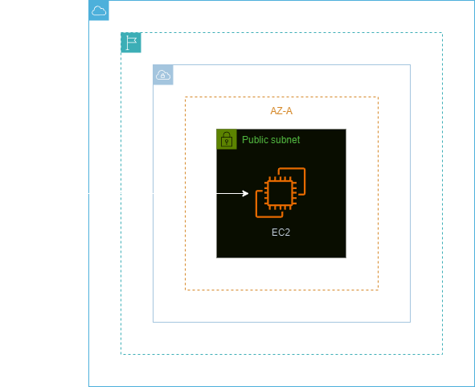

<h1 align=center> Amazon EC2 - Provisionando seu primeiro servidor web</h1>

<h2>Arquitetura do laboratório</h2>

    

<h2> Conteúdo do laboratório </h2>

Neste laboratório iremos aprender como criar uma instância do EC2, atribuir um IP público a essa instância e iniciar um servidor Web na nuvem da AWS.

<h2>Tarefas a serem executadas</h2>

1. Acesse a console de gerenciamento da AWS.
2. Crie um security group para sua instância EC2.
3. Crie uma instância EC2.
4. Teste o acesso ao servidor web.

<h2>Resultado</h2>

    

    

