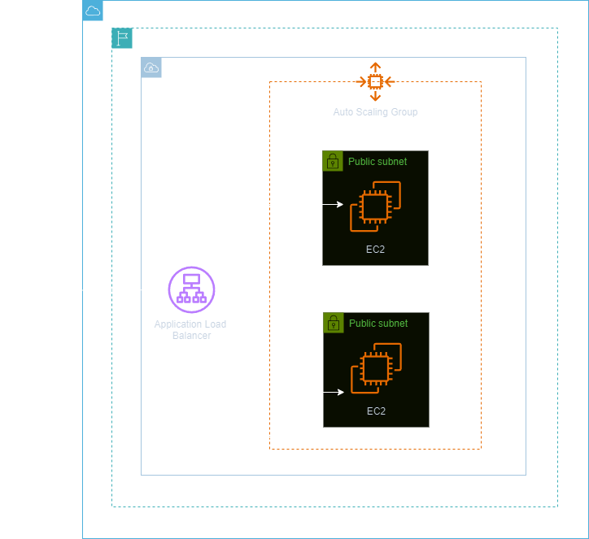

<h1 align=center> Amazon EC2 - Provisionando um serviço web com EC2 + ELB + EC2 Auto Scaling</h1>

<h2>Arquitetura do laboratório</h2>

    

---

<h2>Elastic Load Balancing (ELB)</h2>

O Elastic Load Balancing (ELB) distribui automaticamente o tráfego de aplicações de entrada entre vários destinos e dispositivos virtuais em uma ou mais Zonas de Disponibilidade (AZs). 

<h2>Auto Scaling</h2>

Os Grupos do Auto Scaling da AWS é uma ferramenta fundamental para otimizar a escalabilidade e a resiliência em ambientes de nuvem. Este recurso permite a automação da adição ou remoção de instâncias EC2 conforme a demanda da aplicação. Ao configurar políticas baseadas em métricas específicas, como CPU ou utilização de recursos, o Auto Scaling garante que o número de instâncias esteja sempre alinhado com as necessidades do sistema. Além disso, o Auto Scaling pode ser integrado a um balanceador de carga, o Elastic Load Balancer (ELB), para distribuir o tráfego de maneira uniforme e manter a alta disponibilidade da aplicação.

---

<h2> Conteúdo do laboratório </h2>

Neste laboratório, você aprenderá a adicionar e montar um volume EBS em uma instância Linux.

<h2>Tarefas a serem executadas</h2>

1. Faça login na AWS.
2. Crie as instâncias EC2 A e EC2 B.
3. Verifique as EC2 criadas.
4. Crie um Target Group.
5. Crie um Application Load Balancer (ALB).
6. Crie um Modelo de Execução para o Auto Scaling Group (ASG).
7. Crie um Launch template (Modelo de execução).
8. Crie um Auto Scaling Group (ASG).
9. Teste o Auto Scaling Group (ASG), o Target Group e seu Elastic Load Balancer.

<h2>Resultado</h2>

    

    

